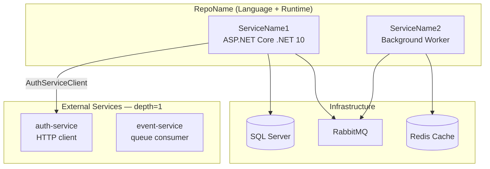

# dep-map

Generates or updates a structured lode dependency document for a scope. Scans all repos
under the given path for package dependencies (NuGet, npm/yarn, Maven), detects
infrastructure dependencies from config files, and writes
`lode/<scope>/dep-map.md` with per-repo service layer Mermaid diagrams and a
cross-repo dependency heat map.

## Usage

```
/dep-map auth
/dep-map payments src/services
/dep-map platform /path/to/repos/platform
```

The first argument is the **scope label** (used for lode output naming and headings).
The optional second argument is the **path** to scan for repos. If omitted:
1. Check if `repos/<scope>/` exists under cwd — use it if found
2. Otherwise treat cwd itself as the single repo to scan

---

## Path Resolution

| Concept              | Resolved as                                              |
| -------------------- | -------------------------------------------------------- |
| Scope label          | First argument — used in lode path and headings          |
| Scan root            | Second argument, or `repos/<scope>/`, or cwd (use absolute paths in tool calls; never write them into lode output) |
| Lode output          | `lode/<scope>/dep-map.md` (relative to cwd)              |
| Lode map             | `lode/lode-map.md` (relative to cwd)                     |

Use absolute paths in all tool calls. Resolve cwd at runtime with `pwd`.

---

## Workflow

### Step 1 — Parse and validate arguments

Extract the scope label from `$ARGUMENTS`. The first word is the scope label; any
remaining text is the scan path.

**If no argument:** explain usage with examples and stop.

**Resolve the scan root:**
1. If a path argument was given, verify it exists. If not, report an error and stop.
2. If no path given, check if `<cwd>/repos/<scope>/` exists. Use it if found.
3. Otherwise use `<cwd>` as the scan root.

**Identify repos to scan:**

A **repo** is any immediate subdirectory of the scan root that contains at least one
package manifest (`.csproj`, `pom.xml`, `package.json`, `go.mod`, `Cargo.toml`). If
the scan root itself contains package manifests (i.e. it is a single repo), treat it
as a single-repo run.

Run these Globs from the scan root to discover repos:
```
<scan-root>/**/*.csproj       (depth ≤ 4)
<scan-root>/**/pom.xml        (depth ≤ 4)
<scan-root>/**/package.json   (depth ≤ 4, exclude node_modules)
<scan-root>/**/go.mod         (depth ≤ 4)
<scan-root>/**/Cargo.toml     (depth ≤ 4)
```

Group results by the immediate subdirectory of the scan root to identify distinct
repos. If the scan root is itself a repo (manifests appear at depth 1–2), use the
scan root's directory name as the single repo name.

---

### Step 2 — Check for existing lode doc

Check whether `lode/<scope>/dep-map.md` exists relative to cwd.

- **Exists:** update run — note the `*Updated:` timestamp from the file's last line
- **Missing:** create run — create the lode directory if needed

Also read any existing lode files for this scope that may contain service names or
architecture facts:
- `lode/<scope>/architecture.md`
- `lode/<scope>/tech-stack.md`
- `lode/<scope>/services.md`

These supply service names, runtime versions, and infra facts that won't be present
in package manifests alone.

---

### Step 3 — Scan each repo

For each repo discovered, perform the sub-steps below. Parallelize the manifest
searches within each repo (run Globs simultaneously).

#### 3a — Detect language and locate manifests

Run these Glob patterns **in parallel** (excluding `node_modules/`, `**/bin/**`,
`**/obj/**`):

| Glob                                    | Purpose                     |
| --------------------------------------- | --------------------------- |
| `<repo-dir>/**/*.csproj`                | .NET NuGet                  |
| `<repo-dir>/**/pom.xml`                 | Java Maven                  |
| `<repo-dir>/**/package.json`            | Node / npm / yarn           |
| `<repo-dir>/**/Directory.Packages.props`| Central NuGet versions      |
| `<repo-dir>/**/go.mod`                  | Go modules                  |
| `<repo-dir>/**/Cargo.toml`              | Rust crates                 |
| `<repo-dir>/**/requirements*.txt`       | Python pip                  |
| `<repo-dir>/**/pyproject.toml`          | Python pyproject            |

From the manifest types found, determine the repo's **primary language(s)**:

| Manifests present            | Language             |
| ---------------------------- | -------------------- |
| `.csproj` only               | C# / .NET            |
| `pom.xml` only               | Java                 |
| `package.json` only          | TypeScript / JS      |
| `.csproj` + root `package.json` | C# + TypeScript   |
| `go.mod`                     | Go                   |
| `Cargo.toml`                 | Rust                 |
| `requirements*.txt` / `pyproject.toml` | Python     |

#### 3b — Parse NuGet dependencies (.csproj)

For each `.csproj` file found:

1. Skip test/bench projects whose name matches `*.Tests.csproj`, `*.Test.csproj`,
   `*.UnitTests.csproj`, `*.IntegrationTests.csproj`, `*.Benchmarks.csproj`.

2. Read the file. Extract all `<PackageReference>` lines. Also read
   `Directory.Packages.props` if present (it holds the canonical version numbers).

3. Use Grep with pattern `PackageReference Include="([^"]+)"` to extract package names.
   Resolve versions from the `.csproj` `Version=` attribute or from
   `Directory.Packages.props`.

4. Classify each package (see **Dependency Classification**).

5. Build two lists per repo:
   - **External service integrations** — client packages referencing other services
     in this codebase (detect via naming patterns: `.Api.Client`, `.Client.Abstractions`,
     `.Private.Api.Client`, `.Public.Api.Client`, `-sdk-client`)
   - **Key third-party** — messaging, ORM/DB, DI, auth, observability, scheduler libs

#### 3c — Parse Maven dependencies (pom.xml)

For each `pom.xml` found at depth ≤ 2 within the repo (skip deep sub-module POMs
that are clearly build tooling):

1. Read the file. Use Grep to extract `<groupId>` / `<artifactId>` / `<version>`
   triples from the `<dependencies>` section. The `<parent>` block is not a runtime
   dependency — skip it.

2. Classify each dependency (see **Dependency Classification**).

3. Also Grep Java source files for service client instantiation patterns that reveal
   cross-repo service integrations not captured by Maven coordinates:

   ```
   Grep pattern: "\w+ClientBuilder\(\)"
   Grep pattern: "\w+ClientImpl\.builder\(\)"
   Grep pattern: "\w+ClientFactory\."
   ```

   Run against `<repo-dir>/src/**/*.java`.

#### 3d — Parse npm / yarn dependencies (package.json)

For each `package.json` found that is **not** inside `node_modules/`:

1. Read the file. Extract the `dependencies` and `devDependencies` objects.

2. If `name` field contains `test` or `spec`, classify all deps as dev/test.

3. Classify packages (see **Dependency Classification**).

4. For frontend SPA repos (Angular, React, Vue), always list:
   - Framework: `@angular/*`, `react`, `vue`
   - State/data: `rxjs`, `ngrx`, `zustand`, `tanstack-query`
   - Build: webpack, `@module-federation/*`, vite
   - UI: ReactFlow, ag-grid, primeng, material
   - Testing: vitest, playwright, jest, cypress

#### 3e — Parse Go modules (go.mod)

For each `go.mod` found:

1. Read the file. Extract `require` block entries.
2. Classify: stdlib (`golang.org/x/*`, `google.golang.org/*`), first-party (same
   module prefix), third-party open source.
3. Note key frameworks: gin, echo, fiber, chi (HTTP); gorm, pgx, sqlx (DB);
   cobra (CLI); zerolog, zap (logging).

#### 3f — Parse Rust crates (Cargo.toml)

For each `Cargo.toml` found:

1. Read the file. Extract `[dependencies]` and `[dev-dependencies]` sections.
2. Classify workspace members vs external crates.
3. Note key crates: tokio, actix-web, axum (async/HTTP); sqlx, diesel (DB);
   serde (serialization); tracing (observability).

#### 3g — Parse Python dependencies (requirements*.txt / pyproject.toml)

For each manifest found:

1. `requirements*.txt`: read and extract package specs (name + optional version pin).
2. `pyproject.toml`: extract `[project.dependencies]` and optional tool sections.
3. Classify and note key frameworks: FastAPI, Flask, Django (HTTP); SQLAlchemy,
   Alembic (DB); pytest (test); pydantic (validation); celery (tasks).

#### 3h — Detect infrastructure dependencies from config

Grep config files for infrastructure clues. Run in parallel:

**Files to check:**
- `**/appsettings*.json` (exclude `appsettings.Test*.json`)
- `**/application.yml` and `**/application.properties`
- `**/application-*.yml` and `**/application-*.properties`
- `**/.env` and `**/.env.example` (exclude `.env.local`, `.env.test`)
- `**/config.yml`, `**/config.yaml`, `**/config.json`

**Infrastructure signals:**

| Grep pattern                                         | Infrastructure dep       |
| ---------------------------------------------------- | ------------------------ |
| `"ConnectionStrings"` or `jdbc:sqlserver` or `postgres://` | SQL (MSSQL/Postgres) |
| `"Redis"` or `spring\.data\.redis` or `REDIS_URL`   | Redis Cache              |
| `"RabbitMQ"` or `spring\.rabbitmq` or `RABBITMQ_`   | RabbitMQ                 |
| `"CosmosDb"` or `"CosmosDB"`                         | Azure CosmosDB           |
| `BlobStorage` or `AzureWebJobsStorage` or `S3_BUCKET`| Blob / Object Storage    |
| `ServiceBus` or `EVENT_HUB`                          | Azure Service Bus        |
| `"Elasticsearch"` or `spring\.elasticsearch` or `ELASTIC_` | Elasticsearch       |
| `"ArangoDB"` or `arangodb`                           | ArangoDB                 |
| `"MongoDB"` or `MONGO_URI`                           | MongoDB                  |
| `kafka\.bootstrap` or `KAFKA_BROKERS`                | Apache Kafka             |
| `Quartz` or `quartz\.datasource`                     | Quartz Job Store         |
| `HangfireSettings` or `"Hangfire"`                   | Hangfire scheduler       |
| `NATS_URL` or `nats://`                              | NATS messaging           |

Use Grep with `-i` (case-insensitive) for all patterns. Record which infra deps are
confirmed (pattern found) vs inferred (package dep implies infra without config confirmation).

#### 3i — Build the Mermaid service layer diagram

For each repo, build one `graph TB` diagram:



**Diagram construction rules:**

1. **External services = depth 1 only.** Show only services this repo calls directly.
   Do NOT show what those services connect to downstream.

2. **Service name sources** (priority order):
   - Existing lode `architecture.md` or `tech-stack.md` for this scope
   - Dockerfile `ENV` or `LABEL` lines
   - Kubernetes deployment YAML (`metadata.name`, `app:` label)
   - Fallback: use repo name reformatted to camelCase

3. **Edge labels** must state the integration mechanism:
   - NuGet package: `"PackageName"` (package name)
   - Maven artifact: `"groupId:artifactId"`
   - npm package: `"package-name"`
   - Hand-written HTTP client: `"HTTP: ClientClassName"`
   - Message queue: `"MQ: queue.name"` or `"RabbitMQ pub"`

4. **Mermaid node ID rules:** alphanumeric + underscore only — no dots, dashes, spaces.

5. **Size limit:** Keep the diagram under 25 nodes. For repos with many external
   dependencies, group minor ones into a single `"Other services"` node.

6. **Non-service repos** (SQL schemas, Infra/Terraform, QA automation, scripts) —
   draw a minimal single-node diagram labeling the repo type, or note
   "No running services — infrastructure/tooling repo."

7. **Shape conventions:**
   - Service nodes: rectangle `svc["Label"]`
   - Databases: cylinder `db[("Label")]`
   - Message queues: rectangle `mq["Label (queue)"]`
   - External services: rectangle in `extsvcs` subgraph

8. **Docker base image in service labels:** Include runtime image tag when known.
   Example: `svc1["admin-api\nmcr.microsoft.com/dotnet/aspnet:10.0-alpine"]`

#### 3j — Detect runtime versions and Docker images

Collect runtime pinning from these files. Run all Globs in parallel.

| File                                          | What it provides                     |
| --------------------------------------------- | ------------------------------------ |
| `**/Dockerfile` and `**/Dockerfile.*`         | Base runtime image + SDK build image |
| `**/global.json`                              | .NET SDK version pin                 |
| `**/.nvmrc` or `**/.node-version`             | Node.js version pin                  |
| `**/.java-version` or `**/.tool-versions`     | Java / SDKMAN version pin            |
| `**/.sdkmanrc`                                | SDKMAN-managed SDK versions          |
| `**/azure-pipelines.yml`, `**/.azure/**/*.yml`| CI SDK task versions                 |
| `**/.github/workflows/*.yml`                  | GitHub Actions SDK versions          |
| `**/*.csproj` (`<TargetFramework>`)           | .NET target framework per project    |
| `**/pom.xml` (`java.version`, `maven.compiler.source`) | Java compile target       |
| `**/package.json` (`engines` field)           | Node.js / npm engine constraints     |
| `**/go.mod` (`go` directive)                  | Go toolchain version                 |
| `**/rust-toolchain.toml`                      | Rust toolchain pin                   |

**Dockerfile parsing:**

1. Glob for all `Dockerfile*` files (excluding `.dockerignore`).
2. Extract every `FROM` instruction. Distinguish runtime stages (image contains
   `aspnet`, `runtime`, `jre`, `node`, `alpine` without `sdk`) from build stages
   (image contains `sdk`, `build`, `maven`, `gradle`).
3. Record the **runtime image** (final `FROM` or stage named `runtime`/`final`) and
   the **SDK/build image**.

**Common Docker image patterns:**

| Image pattern                              | Runtime                      |
| ------------------------------------------ | ---------------------------- |
| `mcr.microsoft.com/dotnet/aspnet:<ver>`    | .NET runtime (production)    |
| `mcr.microsoft.com/dotnet/sdk:<ver>`       | .NET SDK (build stage)       |
| `eclipse-temurin:<ver>-jre*`               | OpenJDK runtime (production) |
| `eclipse-temurin:<ver>-jdk*`               | OpenJDK SDK (build/runtime)  |
| `amazoncorretto:<ver>`                     | Amazon Corretto JDK          |
| `node:<ver>-alpine`                        | Node.js runtime              |
| `maven:<ver>-eclipse-temurin-<jdk>`        | Maven + JDK (build stage)    |
| `gradle:<ver>-jdk<ver>`                    | Gradle + JDK (build stage)   |
| `python:<ver>-slim`                        | Python runtime               |
| `golang:<ver>-alpine`                      | Go build/runtime             |

**CI pipeline SDK tasks:**

Grep CI YAML files for:
- `UseDotNet` task → `version:` field
- `JavaToolInstaller` / `UseJava` → `versionSpec:`
- `NodeTool` → `versionSpec:`
- `actions/setup-*` (GitHub Actions) → `node-version:`, `java-version:`, `dotnet-version:`

**Per-repo runtime record:**

```
runtime_image:    <image>:<tag>
sdk_image:        <image>:<tag>  (build stage)
dotnet_sdk_pin:   <version>  (from global.json)
target_framework: <moniker>  (from .csproj)
java_version:     <ver>  (from pom.xml / .java-version)
node_version:     <ver>  (from .nvmrc / package.json engines)
go_version:       <ver>  (from go.mod)
ci_sdk_version:   <ver>  (from CI YAML)
```

Mark undetected fields as `—`.

---

### Step 4 — Compose the lode document

Write the complete document to `lode/<scope>/dep-map.md` (relative to cwd).

#### Document structure

```markdown
# <Scope> — Dependency Map

> Scope: `<scope>` | Scan root: `<directory name or relative path — never an absolute path>`
> Repos discovered: **T** | Scanned: **N** | Skipped (no manifests): **K**

## Repo Summary

| Repo | Language | Runtime Image | SDK Pin | External Service Deps | Infrastructure | Key Third-Party |
|------|----------|--------------|---------|----------------------|----------------|-----------------|
| RepoName | C# / .NET 10 | `dotnet/aspnet:10.0-alpine` | SDK 10.0.100 | auth-client, billing-client | SQL, Redis, RabbitMQ | MassTransit 8.x, Dapper |
| RepoName2 | Java 21 | `eclipse-temurin:21-jre` | — | notification-client | SQL, Redis | Spring Boot 4.x, Flowable |

## Cross-Repo Dependency Heat Map

### External Service Dependencies

| External Service | Repos that depend on it |
|-----------------|------------------------|
| auth-service | RepoA, RepoB |
| notification-service | RepoA, RepoC |

### Infrastructure

| Infrastructure | Repos that use it |
|----------------|------------------|
| SQL Server | RepoA, RepoB, RepoC |
| Redis Cache | RepoA, RepoB |
| RabbitMQ | RepoA, RepoB, RepoC |

### Runtime Images

| Base image | Tag | Type | Repos |
|-----------|-----|------|-------|
| `mcr.microsoft.com/dotnet/aspnet` | `10.0-alpine` | .NET runtime | RepoA, RepoB |
| `eclipse-temurin` | `21-jre-alpine` | Java runtime | RepoC |
| `mcr.microsoft.com/dotnet/sdk` | `10.0-alpine` | .NET build | RepoA, RepoB |

> ⚠ Image tags pinned to a minor version drift with patches. Fully reproducible tags
> use a digest (`@sha256:...`). Unpinned (`:latest`) tags are a supply chain risk.

---

## Per-Repo Details

### RepoName

**Language:** C# / .NET 10

#### Runtime & SDK Versions

| Artifact | Value | Source |
|----------|-------|--------|
| Runtime image | `mcr.microsoft.com/dotnet/aspnet:10.0-alpine` | `Dockerfile` (final stage) |
| Build/SDK image | `mcr.microsoft.com/dotnet/sdk:10.0-alpine` | `Dockerfile` (build stage) |
| .NET SDK pin | `10.0.100` | `global.json` |
| Target framework | `net10.0` | `ServiceName.csproj` |
| CI SDK task | `10.x` | `azure-pipelines.yml` UseDotNet |

#### External Service Integrations

| Service | Integration Method | Package / Artifact |
|---------|-------------------|--------------------|
| auth-service | NuGet client | `Company.Auth.Api.Client` v1.2.0 |
| billing-service | HTTP (hand-written) | `HTTP: BillingServiceClient` |

#### Infrastructure Dependencies

SQL Server (ConnectionStrings.DefaultConnection), Redis Cache, RabbitMQ (MassTransit)

#### Key Third-Party Packages

| Package | Version | Role |
|---------|---------|------|
| MassTransit | 8.x | RabbitMQ messaging |
| Dapper | 2.x | SQL micro-ORM |

#### Service Layer Diagram


---

[Repeat Per-Repo section for each repo]

---

*Updated: <UTC timestamp in format 2026-04-21T00:00:00Z>*
```

**Writing rules:**
- UTC timestamp on the last line: `*Updated: 2026-04-21T14:32:00Z*`
- If updating an existing file, rewrite it entirely. The lode captures current state.
- Omit empty sections.
- For repos with > 30 third-party packages, list only architecturally significant ones.
  Add: `> N additional packages omitted. See <relative path to manifest>.`
- **Never embed absolute home-directory paths** (e.g. paths starting with `~` expanded to a real username).
  Use the directory name (e.g. `dotnet-reference`) or a repo-relative path instead.

---

### Step 5 — Update lode-map.md

After writing `dep-map.md`, check `lode/lode-map.md` for an existing entry for this
file under `<scope>/`.

If `dep-map.md` is not listed: add a line for it. Use a concise one-line description:
`dep-map.md — NuGet/npm/Maven/Go/Rust deps, Docker runtime images, SDK pins + service layer diagrams for all <N> repos`.

---

### Step 6 — Report to user

```
dep-map: <scope> — done

Output: lode/<scope>/dep-map.md
Repos scanned: N of T (K skipped — no manifests found)

Top cross-repo service dependencies:
  1. <service> — <N repos>
  2. <service> — <N repos>

Infrastructure in use: <comma-separated list>

Runtime images:
  Production: <unique base images + tags>
  Build/SDK:  <unique build images + tags>
  ⚠ Unpinned tags: <repos with :latest or no tag, or "none">

Most common third-party dependencies:
  .NET:   <top 3>
  Java:   <top 3>
  JS:     <top 3>
  Go:     <top 3 if present>
  Python: <top 3 if present>

Skipped repos: <list names, or "none">
```

---

## Dependency Classification

### Package classification

| Package name / group ID pattern                  | Classification              |
| ------------------------------------------------- | --------------------------- |
| `Microsoft.*`, `System.*`, `Azure.*`              | Microsoft / Azure SDK       |
| `org.springframework.*`                           | Spring framework            |
| `org.flowable.*`, `com.flowable.*`                | Flowable workflow engine    |
| `org.apache.*`, `ch.qos.*`, `io.micrometer.*`     | Apache / observability      |
| Same module prefix as the repo being scanned      | First-party (same codebase) |
| All others                                        | Third-party open source     |

**First-party detection:** If the package/module prefix matches patterns already seen
in other repos within the scope scan root (same company namespace, same go module
prefix, same npm org), classify as first-party cross-repo integration.

### External service integration detection

A package is an **external service integration** if its name ends in:
- `.Api.Client`, `.Api.Client.Abstractions`, `.Private.Api.Client`, `.Public.Api.Client`
- `.Client` (if the base name is clearly a service, not a framework utility)
- `-api-client`, `-sdk-client` (Java/npm artifact IDs)
- `-client` (Go / npm, when the base name is a service)

If a client package has no known mapping, record it verbatim and mark:
`⚠ service mapping unknown — verify against repo list`.

### Test-only dependencies (omit from production tables)

| Pattern                                      | Skip reason         |
| -------------------------------------------- | ------------------- |
| `xunit.*`, `NUnit.*`, `MSTest.*`             | .NET test frameworks |
| `Moq`, `NSubstitute`, `FakeItEasy`           | Mocking             |
| `testcontainers.*`, `org.testcontainers.*`   | Containerized tests  |
| `Bogus`, `AutoFixture`                       | Test data           |
| `pytest`, `unittest`                         | Python test         |
| `jest`, `vitest`, `cypress`, `playwright`    | JS/TS test          |
| Any package in a `*.Tests.csproj` exclusively| Test project only   |

---

## Edge Cases

### Single-repo scan root
When the scan root itself is a repo (not a parent of multiple repos), treat it as
a single-repo run. Scope label becomes the section heading; per-repo header uses
the directory name.

### Repo with no cloneable content (empty dir)
Include in summary table with `⚠ no manifests found`. Skip detailed scanning.

### Non-service repos (infra, SQL, tooling, QA)
Repos whose names contain: `sql`, `infra`, `terraform`, `performance`, `qa`,
`automation`, `design`, `release`, `scripts`, `common` (library, no service).
Include in summary table with type noted. Skip service layer diagram or draw a
minimal single-node diagram labeled with the repo type.

### Multiple .csproj files per repo
Aggregate all non-test `.csproj` dependencies. De-duplicate across files. Note
project count: `**Projects:** 3 (.csproj files, tests excluded)`.

### Large dependency lists (> 30 packages)
List only architecturally significant packages (messaging, ORM, DI, auth,
observability, scheduler, key frameworks). Add footnote:
`> N additional packages omitted. Full list: <relative path to manifest>.`

### Maven multi-module repos
Read the root `pom.xml` and first-level sub-module POMs. Skip deeply nested test
sub-modules. Aggregate unique `<dependency>` entries across parent + main service
module POM only.

### package.json in Angular/React monorepo
Read root `package.json` and the main application's `package.json`. Skip library
sub-projects.

### No Dockerfile found
Mark runtime image as `—`. Note: `No container image — library/tooling repo.`

### Multi-stage Dockerfile
Identify the **final** stage (last `FROM` without `AS`, or named `final`, `release`,
`production`, `runtime`). That is the production image. List build stages
comma-separated in the SDK/build image column.

### Dockerfile with no tag (`:latest` or no tag)
Note it as `⚠ unpinned`. Flag in the report summary.

### global.json rollForward policy
Record `sdk.version` and `rollForward` policy. `patch`/`latestPatch` are safe;
`major`/`latestMajor` is permissive — flag it.

### CI SDK version differs from global.json
Record both values with `⚠ mismatch` note.

---

## User input

$ARGUMENTS
