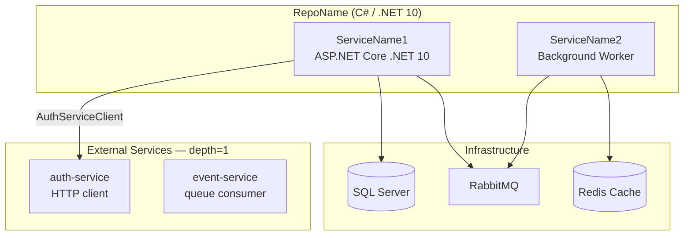

# dep-map — Output Template

Full document structure for `lode/<scope>/dep-map.md`. Used in Step 4 of the dep-map workflow.

---

## Document structure

```markdown
# <Scope> — Dependency Map

> Scope: `<scope>` | Scan root: `<directory name or relative path — never an absolute path>`
> Repos discovered: **T** | Scanned: **N** | Skipped (no manifests): **K**

## Repo Summary

| Repo | Language | Runtime Image | SDK Pin | External Service Deps | Infrastructure | Key Third-Party |
|------|----------|--------------|---------|----------------------|----------------|-----------------|
| RepoName | C# / .NET 10 | `dotnet/aspnet:10.0-alpine` | SDK 10.0.100 | auth-client, billing-client | SQL, Redis, RabbitMQ | MassTransit 8.x, Dapper |
| RepoName2 | Java 21 | `eclipse-temurin:21-jre` | — | notification-client | SQL, Redis | Spring Boot 4.x, Flowable |

## Cross-Repo Dependency Heat Map

### External Service Dependencies

| External Service | Repos that depend on it |
|-----------------|------------------------|
| auth-service | RepoA, RepoB |
| notification-service | RepoA, RepoC |

### Infrastructure

| Infrastructure | Repos that use it |
|----------------|------------------|
| SQL Server | RepoA, RepoB, RepoC |
| Redis Cache | RepoA, RepoB |
| RabbitMQ | RepoA, RepoB, RepoC |

### Runtime Images

| Base image | Tag | Type | Repos |
|-----------|-----|------|-------|
| `mcr.microsoft.com/dotnet/aspnet` | `10.0-alpine` | .NET runtime | RepoA, RepoB |
| `eclipse-temurin` | `21-jre-alpine` | Java runtime | RepoC |
| `mcr.microsoft.com/dotnet/sdk` | `10.0-alpine` | .NET build | RepoA, RepoB |

> ⚠ Image tags pinned to a minor version drift with patches. Fully reproducible tags
> use a digest (`@sha256:...`). Unpinned (`:latest`) tags are a supply chain risk.

---

## Per-Repo Details

### RepoName

**Language:** C# / .NET 10

#### Runtime & SDK Versions

| Artifact | Value | Source |
|----------|-------|--------|
| Runtime image | `mcr.microsoft.com/dotnet/aspnet:10.0-alpine` | `Dockerfile` (final stage) |
| Build/SDK image | `mcr.microsoft.com/dotnet/sdk:10.0-alpine` | `Dockerfile` (build stage) |
| .NET SDK pin | `10.0.100` | `global.json` |
| Target framework | `net10.0` | `ServiceName.csproj` |
| CI SDK task | `10.x` | `azure-pipelines.yml` UseDotNet |

#### External Service Integrations

| Service | Integration Method | Package / Artifact |
|---------|-------------------|--------------------|
| auth-service | NuGet client | `Company.Auth.Api.Client` v1.2.0 |
| billing-service | HTTP (hand-written) | `HTTP: BillingServiceClient` |

#### Infrastructure Dependencies

SQL Server (ConnectionStrings.DefaultConnection), Redis Cache, RabbitMQ (MassTransit)

#### Key Third-Party Packages

| Package | Version | Role |
|---------|---------|------|
| MassTransit | 8.x | RabbitMQ messaging |
| Dapper | 2.x | SQL micro-ORM |

#### Service Layer Diagram



---

[Repeat Per-Repo section for each repo]

---

*Updated: <UTC timestamp — 2026-04-21T00:00:00Z>*
```

---

## Writing rules

- UTC timestamp on the last line: `*Updated: 2026-04-21T14:32:00Z*`
- If updating an existing file, rewrite it entirely — the lode captures current state, not a diff.
- Omit empty sections entirely.
- For repos with > 30 third-party packages, list only architecturally significant ones. Add: `> N additional packages omitted. See <relative path to manifest>.`
- **Never embed absolute home-directory paths.** Use directory name (e.g. `dotnet-reference`) or repo-relative paths.
