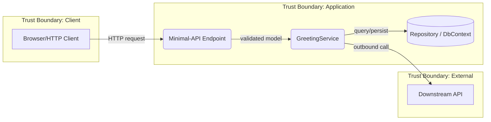

# Threat Model

Framework definitions (STRIDE matrix, STRIDE-to-CAPEC bridge, DREAD-lite scoring,
.NET CAPEC patterns, mitigation-discovery greps) live in
[references/stride-capec-reference.md](references/stride-capec-reference.md). This file is the
workflow and the repo-specific conventions.

## Usage

```bash
/threat-model web                      # Full threat model for a domain/project
/threat-model web --scope endpoints    # Scope to a subsystem
/threat-model --refresh                # Re-run against updated lode/ docs
/threat-model --register-only          # Skip DFD, use existing diagram
```

## Arguments

| Argument           | Required | Description                                                         |
| ------------------ | -------- | ------------------------------------------------------------------- |
| `domain`           | Yes      | Target domain -- a `src/` project (e.g., `web`, `cli`, `core`, `analyzers`) or a `lode/` subdirectory |
| `--scope`          | No       | Narrow to a subsystem within the domain (e.g., `endpoints`, `auth`, `parsing`) |
| `--refresh`        | No       | Force re-read of lode/ sources even if cached in session            |
| `--register-only`  | No       | Skip DFD generation, jump to STRIDE analysis using prior DFD        |
| `--min-score`      | No       | Filter final register to findings at or above this DREAD-lite score (1-27) |

## Design decisions

- Skill reads lode/ and code, not agents -- domain context is already documented
- Mermaid DFD generated by the skill -- mechanical string concatenation, not LLM
- CAPEC drill-down only for HIGH+ findings -- avoids catalog overload on LOW threats
- Output lands in `plans/threat-model-{domain}/`; left unstaged (user controls commits)

## Phases

### Phase 0: Domain Discovery

1. **Read domain lode/** -- load `lode/{domain}/summary.md` (or the nearest matching lode dir,
   e.g. `lode/dotnet/`) and scan for architecture docs, service classes, DI registrations,
   HTTP endpoints, data stores, external dependencies. Map the `domain` argument to a `src/`
   project where one exists (`web`->`E128.Reference.Web`, `cli`->`E128.Reference.Cli`,
   `core`->`E128.Reference.Core`, `analyzers`->`E128.Analyzers`).
2. **If `--scope` provided** -- filter to the subsystem (grep lode/ and src/ for the scope term)
3. **Identify DFD elements** (external entities, processes, data stores, data flows, trust
   boundaries). Repo-specific element types to watch for: minimal-API endpoints, EF Core
   `DbContext`/SQLite stores, in-memory repositories, and -- for `analyzers` -- the build-time
   trust boundary, where untrusted source code is the analyzer's input and the analyzer runs
   inside every consumer's compiler/IDE.
4. **Cross-reference with code** -- use `scripts/find.sh` and `rg` against the resolved project:
   `rg "HttpClient|IHttpClientFactory" src/<project>/ -g "*.cs"` for network flows;
   `rg "DbContext|SqliteConnection|IGreetingRepository" src/ -g "*.cs"` for data stores;
   `rg "MapGet|MapPost|MapPut|MapDelete|app\.Map" src/ -g "*.cs"` for minimal-API endpoints;
   `rg "DiagnosticAnalyzer|CodeFixProvider" src/ -g "*.cs"` for build-time entry points
5. **Build element inventory** -- structured list of all elements with their type and trust boundary

### Phase 1: DFD Construction

Generate a Mermaid data flow diagram from the element inventory.

**Mermaid conventions:**
- `graph LR` layout
- External entities: rectangle nodes (`[Entity Name]`)
- Processes: rounded nodes (`(Process Name)`)
- Data stores: cylinder nodes (`[(Data Store)]`)
- Trust boundaries: subgraph with dashed border label
- Data flows: labeled arrows (`-->|flow description|`)

**Example skeleton (minimal-API web app):**


If `--register-only`, skip this phase and load prior DFD from `plans/threat-model-{domain}/{domain}-dfd.md`.

### Phase 2: STRIDE Analysis

**Seed first.** If the target maps to a known project or .NET archetype, load its surface set
from [references/domain-patterns.md](references/domain-patterns.md) before walking elements --
this avoids re-discovering known threats and anchors scoring.

Walk each trust boundary crossing and data flow, applying the STRIDE-per-element filter
matrix from [references/stride-capec-reference.md](references/stride-capec-reference.md)
to suppress false positives (e.g. don't spoof a data store).

**Output:** Raw threat register -- one row per identified threat:

| ID    | Element/Flow | Category | Threat Description          | Likelihood | Impact |
| ----- | ------------ | -------- | --------------------------- | ---------- | ------ |
| T-001 | User -> API  | Spoofing | Replay stolen session token | Medium     | High   |

Use the SEI structured sentence for each description:
> "An [ACTOR] performs [ACTION] to [ATTACK] an [ASSET] to achieve [EFFECT]"

### Phase 3: CAPEC Drill-Down + DREAD-lite Scoring

For each threat with Likelihood >= Medium OR Impact >= High, using the bridge table,
.NET CAPEC pattern list, and DREAD-lite scoring guide in
[references/stride-capec-reference.md](references/stride-capec-reference.md):

1. **Map to CAPEC mechanism** via the STRIDE-to-CAPEC bridge table.
2. **Identify specific CAPEC patterns** for the element type and tech stack -- note CAPEC ID,
   name, prerequisites; link related CWEs; confirm prerequisites are met in this system.
3. **Score using DREAD-lite** -- Damage x Affected x Exploitability (1-3 each, range 1-27).
   Apply the reference's deployment-shape context adjustments (local-only, CLI, network-facing,
   build-time analyzer).
4. **Derive mitigations** from CAPEC pattern mitigations + STRIDE canonical mitigations.

### Phase 4: Report

1. **Create output directory** -- `mkdir -p plans/threat-model-{domain}/`

2. **Write threat register** to `plans/threat-model-{domain}/{domain}-register.md`:
   - Mermaid DFD (from Phase 1)
   - Severity-grouped findings table (CRITICAL first)
   - CAPEC drill-down for HIGH+ findings
   - Security requirements list (one per mitigation)
   - Existing mitigations already in codebase (grep for security patterns)

3. **Leave the register unstaged** -- do not `git add`; the user controls commits (see
   `.claude/rules/auto-approvals.md`). Just report the file path.

4. **Delta tracking** -- if prior register exists, compute:
   - NEW: threats not in previous register
   - RESOLVED: previous threats no longer applicable
   - UNCHANGED: threats that persist

5. **Cross-reference existing security** -- check any domain security lode (e.g. a
   `lode/{domain}/security.md` if present) and grep `src/` for existing mitigations
   (input validation, auth/authorization attributes, `IHttpClientFactory` usage, parameterized
   queries, output encoding). Mark threats that already have mitigations as MITIGATED with the
   implementation reference. See `references/stride-capec-reference.md` for the discovery checklist.

6. **Print report** to terminal with severity summary and top-3 unmitigated findings

7. **If CRITICAL or HIGH unmitigated findings exist** -- recommend creating a structured plan:
   `"Consider: /dev-planning security-hardening-{domain}"`

## Report Format

See [references/report-format.md](references/report-format.md) for the full template.

## Integration Points

- **org:dev-planning** -- when creating plans for security-sensitive features, recommend running
  `/threat-model` during the investigation phase; feed CRITICAL/HIGH findings into the plan
- **solution-audit** -- dependency/CPM/NuGet-audit and suppression-hygiene dimensions remain
  structural checks in solution-audit; threat-model covers design-level concerns
- **review-orchestrator** / **org:review-pr** -- adversarial PR review can reference the threat
  register when reviewing security-sensitive changes
- **security-review skill** -- code-level OWASP scanning of the current diff; complementary to
  this skill's design-level analysis
- **dep-check** (`scripts/dep-check.sh`) -- supply-chain threats (CAPEC-664) should be confirmed
  against vulnerable/outdated package output
