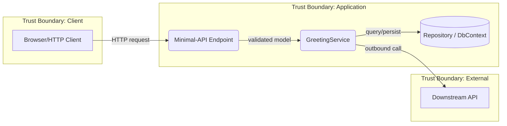

# Threat Model

Design-level security assessment using STRIDE threat identification, CAPEC attack-pattern
drill-down, and DREAD-lite prioritization. Produces a Mermaid DFD and a scored threat
register with traceable mitigations.

## Usage

```bash
/threat-model web                      # Full threat model for a domain/project
/threat-model web --scope endpoints    # Scope to a subsystem
/threat-model --refresh                # Re-run against updated lode/ docs
/threat-model --register-only          # Skip DFD, use existing diagram
```

## Arguments

| Argument           | Required | Description                                                         |
| ------------------ | -------- | ------------------------------------------------------------------- |
| `domain`           | Yes      | Target domain -- a `src/` project (e.g., `web`, `cli`, `core`, `analyzers`) or a `lode/` subdirectory |
| `--scope`          | No       | Narrow to a subsystem within the domain (e.g., `endpoints`, `auth`, `parsing`) |
| `--refresh`        | No       | Force re-read of lode/ sources even if cached in session            |
| `--register-only`  | No       | Skip DFD generation, jump to STRIDE analysis using prior DFD        |
| `--min-score`      | No       | Filter final register to findings at or above this DREAD-lite score (1-27) |

## Architecture

```
/threat-model (skill -- main context)
  Phase 0: Domain Discovery -- read lode/ for target domain, identify components,
           data stores, external entities, data flows, trust boundaries
  Phase 1: DFD Construction -- generate Mermaid data flow diagram with trust
           boundary annotations
  Phase 2: STRIDE Analysis -- walk each trust boundary crossing and data flow,
           apply per-element filter matrix, produce raw threat register
  Phase 3: CAPEC Drill-Down + DREAD-lite Scoring -- for HIGH+ threats, map to
           CAPEC mechanisms, identify specific attack patterns with CWE links,
           score using Damage x Affected x Exploitability (1-3 each)
  Phase 4: Report -- severity-grouped threat register, Mermaid DFD, security
           requirements derived from mitigations, delta from prior run
```

**Key design decisions:**
- Skill reads lode/ and code, not agents -- domain context is already documented
- Mermaid DFD generated by the skill -- mechanical string concatenation, not LLM
- CAPEC drill-down only for HIGH+ findings -- avoids catalog overload on LOW threats
- DREAD-lite (3-factor) replaces full DREAD -- sufficient for solo-dev prioritization
- Output lands in `plans/threat-model-{domain}/` and is `git add`-ed for version tracking

## Phases

### Phase 0: Domain Discovery

1. **Read domain lode/** -- load `lode/{domain}/summary.md` (or the nearest matching lode dir,
   e.g. `lode/dotnet/`) and scan for architecture docs, service classes, DI registrations,
   HTTP endpoints, data stores, external dependencies. Map the `domain` argument to a `src/`
   project where one exists (`web`->`E128.Reference.Web`, `cli`->`E128.Reference.Cli`,
   `core`->`E128.Reference.Core`, `analyzers`->`E128.Analyzers`).
2. **If `--scope` provided** -- filter to the subsystem (grep lode/ and src/ for the scope term)
3. **Identify DFD elements:**
   - **External entities** -- anything outside the trust boundary: users, browsers, HTTP clients,
     external APIs, third-party services, file system inputs, the build/IDE host (for analyzers)
   - **Processes** -- minimal-API endpoints, services, handlers, repositories, CLI commands,
     analyzers and code-fix providers
   - **Data stores** -- databases (EF Core / `DbContext`, SQLite), file system paths, caches,
     in-memory repositories, configuration
   - **Data flows** -- HTTP requests, method calls across trust boundaries, file I/O, IPC,
     analyzer input (untrusted source code) and NuGet package consumption
   - **Trust boundaries** -- user/network input entry points, process boundaries, file system
     boundaries, and the build-time boundary (analyzer runs inside the consumer's compiler/IDE)
4. **Cross-reference with code** -- use `scripts/find.sh` and `rg` against the resolved project:
   `rg "HttpClient|IHttpClientFactory" src/<project>/ -g "*.cs"` for network flows;
   `rg "DbContext|SqliteConnection|IGreetingRepository" src/ -g "*.cs"` for data stores;
   `rg "MapGet|MapPost|MapPut|MapDelete|app\.Map" src/ -g "*.cs"` for minimal-API endpoints;
   `rg "DiagnosticAnalyzer|CodeFixProvider" src/ -g "*.cs"` for build-time entry points
5. **Build element inventory** -- structured list of all elements with their type and trust boundary

### Phase 1: DFD Construction

Generate a Mermaid data flow diagram from the element inventory.

**Mermaid conventions:**
- `graph LR` layout
- External entities: rectangle nodes (`[Entity Name]`)
- Processes: rounded nodes (`(Process Name)`)
- Data stores: cylinder nodes (`[(Data Store)]`)
- Trust boundaries: subgraph with dashed border label
- Data flows: labeled arrows (`-->|flow description|`)

**Example skeleton (minimal-API web app):**


If `--register-only`, skip this phase and load prior DFD from `plans/threat-model-{domain}/{domain}-dfd.md`.

### Phase 2: STRIDE Analysis

**Seed first.** If the target maps to a known project or .NET archetype, load its surface set
from [references/domain-patterns.md](references/domain-patterns.md) before walking elements --
this avoids re-discovering known threats and anchors scoring.

Walk each trust boundary crossing and data flow. For each element, apply the
STRIDE-per-element filter matrix:

| Element Type    | S | T | R | I | D | E |
| --------------- | - | - | - | - | - | - |
| External Entity | x |   | x |   |   |   |
| Process         | x | x | x | x | x | x |
| Data Store      |   | x | x | x | x |   |
| Data Flow       |   | x |   | x | x |   |

For each applicable (element, STRIDE category) pair, ask:
- **Spoofing:** Can an attacker impersonate this entity/process?
- **Tampering:** Can data be modified in transit or at rest?
- **Repudiation:** Can actions be denied without audit trail?
- **Information Disclosure:** Can data leak to unauthorized parties?
- **Denial of Service:** Can legitimate access be prevented?
- **Elevation of Privilege:** Can permissions be exceeded?

**Output:** Raw threat register -- one row per identified threat:

| ID    | Element/Flow | Category | Threat Description          | Likelihood | Impact |
| ----- | ------------ | -------- | --------------------------- | ---------- | ------ |
| T-001 | User -> API  | Spoofing | Replay stolen session token | Medium     | High   |

Use the SEI structured sentence for each description:
> "An [ACTOR] performs [ACTION] to [ATTACK] an [ASSET] to achieve [EFFECT]"

### Phase 3: CAPEC Drill-Down + DREAD-lite Scoring

For each threat with Likelihood >= Medium OR Impact >= High:

1. **Map to CAPEC mechanism** using the bridge table:

   | STRIDE Category      | CAPEC Mechanism                      |
   | -------------------- | ------------------------------------ |
   | Spoofing             | Engage in Deceptive Interactions     |
   | Tampering            | Manipulate Data Structures           |
   | Repudiation          | Inject Unexpected Items              |
   | Information Disclosure | Collect and Analyze Information     |
   | Denial of Service    | Abuse Existing Functionality         |
   | Elevation of Privilege | Subvert Access Control              |

2. **Identify specific CAPEC patterns** relevant to the element type and technology:
   - Note CAPEC ID, name, typical severity, prerequisites
   - Link to related CWEs for code-level traceability
   - Check whether prerequisites are met in this system

3. **Score using DREAD-lite** (3-factor, 1-3 scale each):

   | Factor       | 1 (Low)                    | 2 (Medium)                   | 3 (High)                         |
   | ------------ | -------------------------- | ---------------------------- | -------------------------------- |
   | Damage       | Minor data quality issue   | PII exposure or data loss    | Full system compromise           |
   | Affected     | Single user or session     | Subset of users              | All users or system-wide         |
   | Exploitability | Requires insider access  | Requires authentication      | Unauthenticated, scriptable      |

   **Priority score** = Damage x Affected x Exploitability (range 1-27)

   | Score Range | Priority |
   | ----------- | -------- |
   | 18-27       | CRITICAL |
   | 9-17        | HIGH     |
   | 4-8         | MEDIUM   |
   | 1-3         | LOW      |

4. **Derive mitigations** from CAPEC pattern mitigations + STRIDE canonical mitigations
   (see `references/stride-capec-reference.md`)

### Phase 4: Report

1. **Create output directory** -- `mkdir -p plans/threat-model-{domain}/`

2. **Write threat register** to `plans/threat-model-{domain}/{domain}-register.md`:
   - Mermaid DFD (from Phase 1)
   - Severity-grouped findings table (CRITICAL first)
   - CAPEC drill-down for HIGH+ findings
   - Security requirements list (one per mitigation)
   - Existing mitigations already in codebase (grep for security patterns)

3. **Leave the register unstaged** -- do not `git add`; the user controls commits (see
   `.claude/rules/auto-approvals.md`). Just report the file path.

4. **Delta tracking** -- if prior register exists, compute:
   - NEW: threats not in previous register
   - RESOLVED: previous threats no longer applicable
   - UNCHANGED: threats that persist

5. **Cross-reference existing security** -- check any domain security lode (e.g. a
   `lode/{domain}/security.md` if present) and grep `src/` for existing mitigations
   (input validation, auth/authorization attributes, `IHttpClientFactory` usage, parameterized
   queries, output encoding). Mark threats that already have mitigations as MITIGATED with the
   implementation reference. See `references/stride-capec-reference.md` for the discovery checklist.

6. **Print report** to terminal with severity summary and top-3 unmitigated findings

7. **If CRITICAL or HIGH unmitigated findings exist** -- recommend creating a structured plan:
   `"Consider: /dev-planning security-hardening-{domain}"`

## Report Format

See [references/report-format.md](references/report-format.md) for the full template.

## Integration Points

- **org:dev-planning** -- when creating plans for security-sensitive features, recommend running
  `/threat-model` during the investigation phase; feed CRITICAL/HIGH findings into the plan
- **solution-audit** -- dependency/CPM/NuGet-audit and suppression-hygiene dimensions remain
  structural checks in solution-audit; threat-model covers design-level concerns
- **review-orchestrator** / **org:review-pr** -- adversarial PR review can reference the threat
  register when reviewing security-sensitive changes
- **security-review skill** -- code-level OWASP scanning of the current diff; complementary to
  this skill's design-level analysis
- **dep-check** (`scripts/dep-check.sh`) -- supply-chain threats (CAPEC-664) should be confirmed
  against vulnerable/outdated package output
