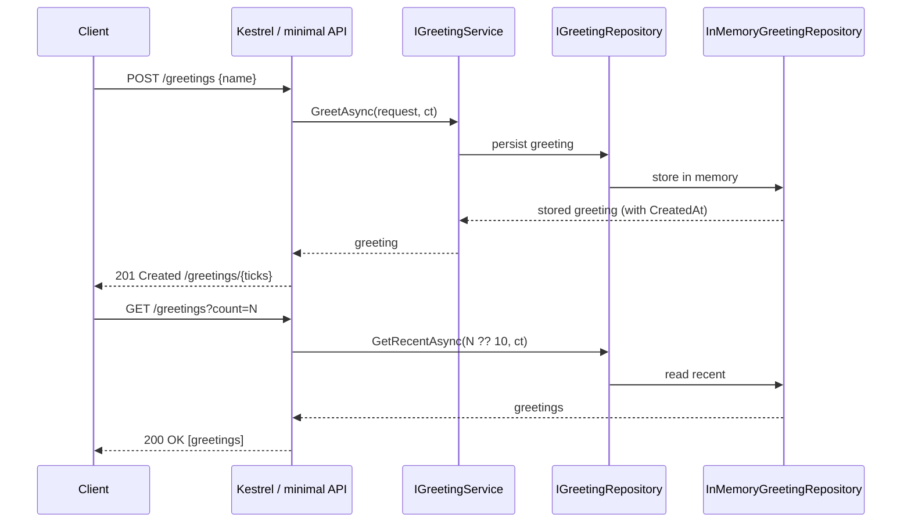
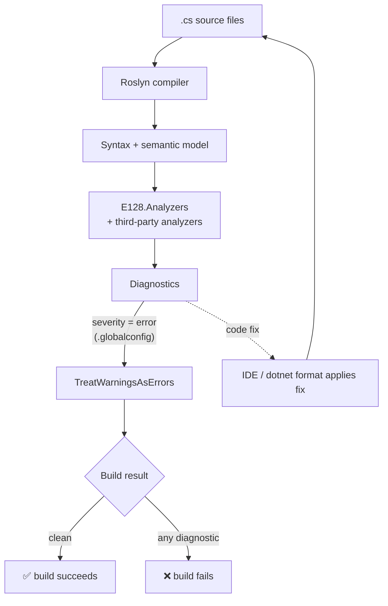

# Data Flow — E128.Reference

> **One sentence:** Two data flows matter — a greeting request moving through the web service's DI-wired domain layer at runtime, and source code moving through the analyzer pipeline at build time.

*Updated: 2026-05-29T19:02:39Z*

---

## Runtime Data Flow — Greeting Request

The composition root is `Program.cs` (top-level statements). It registers `Greeter`, `TimeProvider.System`, `IGreetingRepository → InMemoryGreetingRepository`, `IGreetingService → GreetingService`, and health checks — all as singletons — then maps the four endpoints.

## Build-Time Data Flow — Analyzer Pipeline

## Ingress Patterns

| Entry point        | Mechanism                                              |
| ------------------ | ------------------------------------------------------ |
| HTTP request       | Kestrel → minimal-API route delegates                  |
| CLI invocation     | `System.CommandLine` parses `args`, invokes handler    |
| Build              | Roslyn feeds source into analyzers                     |
| Config binding     | Options classes bound from configuration (pattern demonstrated; analyzer E128033 guards it) |

## Processing Pipelines

- **Greeting**: request → `IGreetingService.GreetAsync` → repository write → response. `CancellationToken` is threaded through (enforced by analyzers across the codebase).
- **Time**: all time access goes through injected `TimeProvider` (analyzer `E128003` forbids `DateTime.Now`/`UtcNow`).

## Egress Patterns

| Exit                | Mechanism                                              |
| ------------------- | ------------------------------------------------------ |
| HTTP response       | `Results.Ok` / `Results.Created` (typed results)       |
| Health              | `GET /health` health-check response                    |
| Diagnostics         | Compiler diagnostics → CI logs / IDE squiggles         |
| Package             | `dotnet pack` → `.nupkg` → nuget.org (analyzer only)   |

## Data Lifecycle

Runtime greeting data lives only in process memory (`InMemoryGreetingRepository`) and is lost on restart — appropriate for a reference demonstrator. The durable "data" of this repo is its **source and metadata**: analyzer `PublicAPI.Shipped.txt`/`Unshipped.txt` and `AnalyzerReleases.Shipped.md`/`Unshipped.md` track the analyzer's API and rule surface across versions (see [storage.md](storage.md)).
