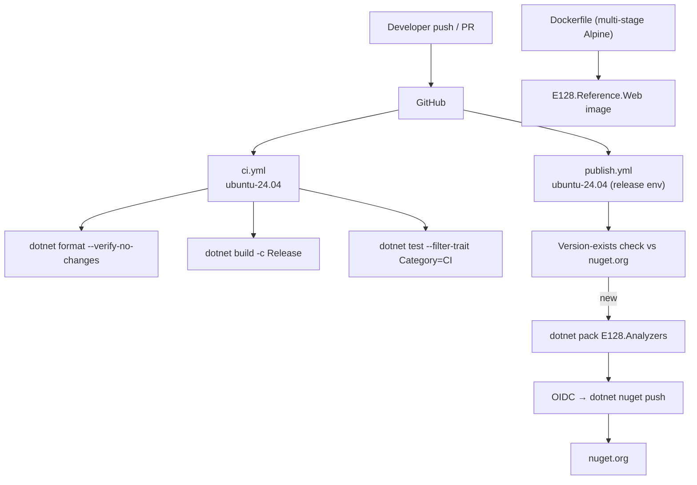
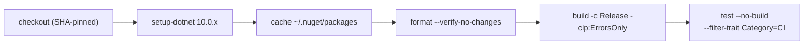

# Deployment & Delivery — E128.Reference

> **One sentence:** Two GitHub Actions workflows drive delivery — `ci.yml` runs format+build+test on every push/PR, and `publish.yml` OIDC-trusted-publishes the analyzer package to nuget.org when its source changes; the web service ships as a multi-stage Alpine container.

*Updated: 2026-05-29T19:02:39Z*

---

## Resource Architecture

## IaC Modules

No cloud IaC (Terraform/Bicep/ARM) is present. "Infrastructure as code" here is:

| Artifact                  | Purpose                                                        |
| ------------------------- | -------------------------------------------------------------- |
| `Dockerfile`              | Multi-stage Alpine build of the web service                    |
| `.github/workflows/ci.yml`| Format + build + test gate                                     |
| `.github/workflows/publish.yml` | Analyzer pack + OIDC push                                |
| `renovate.json`           | Automated dependency updates (group, auto-merge patch/minor)   |
| `scripts/docker.sh`       | Local Docker build/run/test (uses `DOCKER_BUILDKIT=0`)         |

## CI/CD Pipeline

### Branch strategy

- Trunk-based on `main`; feature/fix/refactor branches; squash to one commit per PR.
- `ci.yml` triggers on push to `main` and PRs targeting `main`.

### ci.yml steps (`ubuntu-24.04`)

Locally, the same gate is `scripts/ci.sh` (or `scripts/check.sh` for the composed verify).

### publish.yml (analyzer release)

- **Trigger**: push to `main` touching `src/E128.Analyzers/**`.
- **Gate**: reads `<Version>` from the csproj, queries the nuget.org flat-container API; skips if that version already exists.
- **Auth**: `id-token: write` + `release` environment → OIDC token exchanged for a temporary publish key. No stored NuGet API key.
- **Steps**: checkout → version check → setup-dotnet → cache → `dotnet pack` → `dotnet nuget push`.

## Provisioning

New environments are not provisioned (no cloud footprint). A new **consuming repo** "provisions" itself by adding the `E128.Analyzers` package reference with `PrivateAssets="all"`.

## Secrets Management

| Secret class            | Handling                                              |
| ----------------------- | ----------------------------------------------------- |
| NuGet publish credential| OIDC short-lived token — never stored                 |
| GitHub Actions versions | Pinned by commit SHA (supply-chain hardening)         |
| Application secrets      | None — reference apps have no secrets                 |

## Monitoring & Alerting

| Tool                                       | Tracks                                  |
| ------------------------------------------ | --------------------------------------- |
| GitHub Actions status                      | Build/test/publish success per push     |
| `GET /health` (web service)                | Runtime liveness                        |
| `Microsoft.Testing.Extensions.HangDump`    | Hung tests in CI                        |
| `Microsoft.Testing.Extensions.TrxReport`   | Structured test results                 |
| Renovate                                   | Dependency drift / vulnerable packages  |
