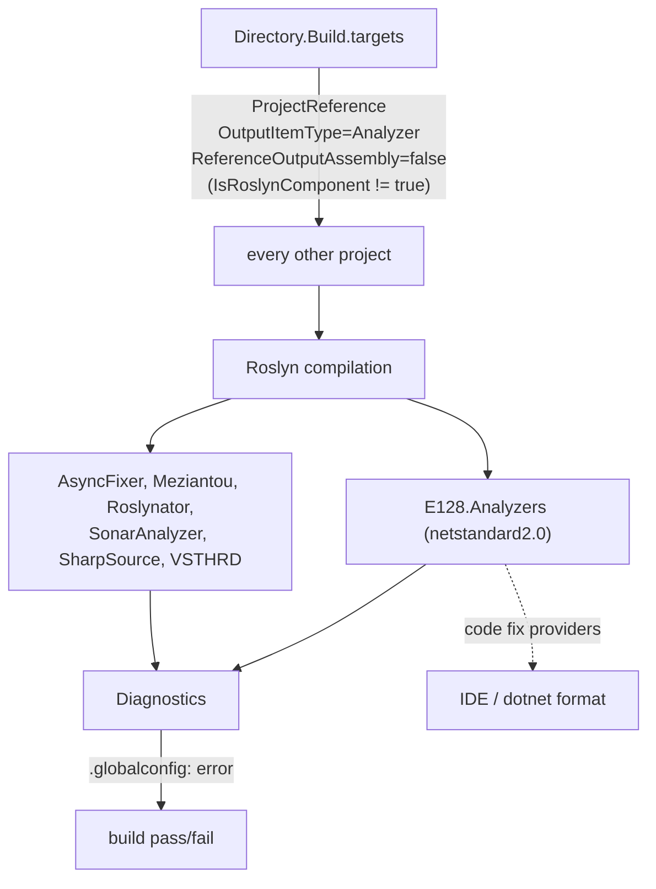

# Integration Patterns — The E128.Analyzers Suite

> **One sentence:** The repository's flagship integration is the build-time one: `E128.Analyzers` injects itself into every project's Roslyn compilation as a ProjectReference and emits ~90 categorized diagnostics, most carrying a one-click code fix.

*Updated: 2026-05-29T19:02:39Z*

---

## How the Analyzer Integrates

The analyzer targets `netstandard2.0` for maximum Roslyn host compatibility. As of 2026-05-29 it contains **90 diagnostic IDs, 85 analyzer classes, and 78 code-fix providers** (see `scripts/analyzer-stats.sh`). Severity defaults differ by surface: the README documents per-rule defaults for external consumers, while inside this repo `.globalconfig` promotes everything to `error`.

> **Severity note.** A handful of rules ship with a non-Warning default for consumers: `E128021`, `E128050`, `E128059`, `E128063`, `E128080` default to **Error**; `E128030`, `E128052`, `E128072`, `E128081` default to **Info**. Inside this repo the blanket `error` severity overrides these.

## Rule Catalog by Category

> Authoritative source: `src/E128.Analyzers/README.md` (the NuGet package page). The tables below mirror it. "Fix" = automatic code fix available.

### Design

| Rule    | Title                                                                 | Fix |
| ------- | --------------------------------------------------------------------- | --- |
| E128001 | Use `FileInfo`/`DirectoryInfo` instead of `string` paths              | Yes |
| E128003 | Use `TimeProvider` instead of `DateTime.Now`/`DateTimeOffset.Now`     | Yes |
| E128004 | Use `IHttpClientFactory` instead of `new HttpClient()`                | Yes |
| E128005 | Seal classes that have no subclasses                                  | Yes |
| E128007 | Avoid `async void` methods (non-event-handler)                        | Yes |
| E128008 | Avoid sync-over-async (`.Result`/`.GetAwaiter().GetResult()`)         | Yes |
| E128017 | Use primary constructor parameter directly                            | Yes |
| E128019 | Do not pass `CancellationToken` by `in` reference                     | Yes |
| E128021 | Do not use `in` with ref struct parameters (Error)                    | Yes |
| E128022 | Remove `ConfigureAwait(false)` in application code                    | Yes |
| E128030 | Do not compare `FileSystemInfo` by reference (Info)                   | Yes |
| E128032 | Concrete-only DI registration with available interface                | Yes |
| E128036 | `Task.Run` wrapping async lambda — unnecessary hop                    | Yes |
| E128042 | `Convert.ToInt32/64` wrapping `ExecuteScalar` without null guard      | Yes |
| E128044 | Implements `IAsyncDisposable` but not `IDisposable`                   | Yes |
| E128045 | Avoid direct `System.Console` usage                                   | No  |
| E128046 | Excessive user-defined inheritance depth                              | No  |
| E128048 | Use `switch` instead of if/else-if chain on enum values               | Yes |
| E128049 | Avoid `[DynamicallyAccessedMembers]` — justify if required            | Yes |
| E128050 | Use `TimeSpan` for time-duration values (Error)                       | Yes |
| E128052 | Use immutable collection interface over mutable concrete (Info)       | Yes |
| E128053 | Use `FileInfo`/`DirectoryInfo` collections over `string` collections  | Yes |
| E128058 | Return `List<T>` via `.AsReadOnly()` for `IReadOnlyList<T>`           | Yes |
| E128059 | Interface method parameter unused in implementation (Error)           | Yes |
| E128060 | Return `Dictionary<K,V>` via `.AsReadOnly()` for `IReadOnlyDictionary`| Yes |
| E128061 | Use `ImmutableArray<T>` for static readonly arrays                    | Yes |
| E128074 | Readonly struct property should use `init` accessor                   | Yes |
| E128080 | Use `ByteSize` for data-size values (Error)                           | Yes |
| E128082 | Do not unwrap `ByteSize` via cast                                     | Yes |
| E128087 | Static numeric field should not be incremented with `++`/`--`         | Yes |

### Reliability

| Rule    | Title                                                                 | Fix |
| ------- | --------------------------------------------------------------------- | --- |
| E128011 | `[GeneratedRegex]` missing `matchTimeoutMilliseconds`                 | Yes |
| E128012 | `RegexOptions.Compiled` redundant in `[GeneratedRegex]`               | Yes |
| E128013 | `[GeneratedRegex]` pattern has overlapping quantifiers                | Yes |
| E128014 | `[GeneratedRegex]` pattern has nested quantifiers                     | Yes |
| E128016 | `DateTime.Parse/ParseExact` missing `DateTimeStyles`                  | Yes |
| E128020 | Do not use `in` with mutable structs                                  | Yes |
| E128023 | Avoid hardcoded `/tmp` path                                           | Yes |
| E128028 | `Task.FromResult` wraps sync I/O with async alternative              | Yes |
| E128031 | `AddSingleton` factory returns `IDisposable`                          | Yes |
| E128033 | Options class bound via `.Bind()` has init-only property              | Yes |
| E128034 | Constructor `new`s a DI-registered type                               | Yes |
| E128035 | Concrete-type DI dependency without direct registration               | Yes |
| E128037 | Unbounded `Task.WhenAll` over async `Select`                          | Yes |
| E128038 | `Task.WhenAll` async lambda missing `CancellationToken`               | Yes |
| E128039 | Catch filter must exclude `OperationCanceledException`                | Yes |
| E128040 | Concurrency limit must be positive                                    | Yes |
| E128041 | `JsonDocument.RootElement` must not escape `using` scope              | Yes |
| E128051 | Broad catch in async `HttpClient` method missing OCE handler          | Yes |
| E128056 | `FileInfo.Exists` TOCTOU race condition                               | Yes |
| E128057 | Unprotected cleanup in `finally` block                                | Yes |
| E128064 | Disk write-then-read round-trip — use in-memory value                 | Yes |
| E128070 | Pool `Rent()` capacity must be bounded                                | No  |
| E128076 | Materialize `QuerySelectorAll` result before iterating                | Yes |
| E128077 | `TextContent` string match requires preceding length guard            | No  |
| E128078 | `GetAttribute("href")` on element that lacks href                     | No  |
| E128079 | `CompositeDetection` single generic ID selector lacks specificity     | No  |
| E128086 | `ArrayPool` buffer as `SqliteParameter` value without `Size`          | Yes |

### Performance

| Rule    | Title                                                                 | Fix |
| ------- | --------------------------------------------------------------------- | --- |
| E128009 | Use `MinBy`/`MaxBy` instead of `OrderBy().First()`                    | Yes |
| E128010 | Pass `HttpCompletionOption.ResponseHeadersRead`                       | Yes |
| E128015 | Use string interpolation instead of `string.Format`                   | Yes |
| E128018 | Use `ToArray()` over `ToList()` for read-only `foreach`              | Yes |
| E128026 | Redundant `HashSet` allocation in `FrozenSet` creation                | Yes |
| E128027 | Use `FrozenSet`/`FrozenDictionary` for static readonly collections    | Yes |
| E128029 | Replace multi-string OR-chain with `HashSet.Contains`                 | Yes |
| E128066 | Linear lookup inside loop → O(n²)                                     | Yes |
| E128067 | String concatenation in loop → O(n²) allocations                      | No  |
| E128068 | Sort inside loop → O(n² log n)                                        | No  |
| E128069 | `List.Insert(0, ...)` in loop → O(n²)                                 | No  |
| E128072 | Prefer `SHA256.HashData()` over `SHA256.Create()` (Info)             | Yes |
| E128081 | Use `StringBuilderPool` over `new StringBuilder()` (Info)            | Yes |
| E128083 | Use `ImmutableCollectionsMarshal.AsImmutableArray` (no copy)         | Yes |
| E128084 | Use `CollectionsMarshal.AsSpan().Slice` over `List.GetRange`         | Yes |
| E128085 | Use `foreach` + `AddRange` over `SelectMany.ToList`                   | Yes |

### Security

| Rule    | Title                                                                 | Fix |
| ------- | --------------------------------------------------------------------- | --- |
| E128071 | Use a FIPS-approved hash algorithm                                    | Yes |
| E128075 | Use `RandomNumberGenerator` instead of `Random` in crypto context     | Yes |

### Style

| Rule    | Title                                                                 | Fix |
| ------- | --------------------------------------------------------------------- | --- |
| E128002 | Use `string.Empty` instead of `""`                                    | Yes |
| E128006 | Use `Encoding.UTF8` instead of `Encoding.Default`                     | Yes |
| E128024 | Non-XML-doc comment above method declaration                          | Yes |
| E128025 | Use `Path.GetRandomFileName()` over `Guid.NewGuid()` in temp paths    | Yes |
| E128043 | Do not use the null-forgiving operator                                | Yes |
| E128047 | `#pragma warning disable` without justification comment               | Yes |
| E128055 | Unbalanced `#pragma warning disable` without matching restore         | Yes |
| E128063 | Mid-name underscore in private static member (Error)                  | Yes |
| E128065 | `#pragma warning disable` with multiple IDs — one per ID              | Yes |

### Testing

| Rule    | Title                                                                 | Fix |
| ------- | --------------------------------------------------------------------- | --- |
| E128054 | Class creates temp directory without cleanup interface                | Yes |
| E128062 | Test uses outdated `ReferenceAssemblies` vs project TFM               | Yes |
| E128073 | Test method missing `[Trait("Category", ...)]`                        | Yes |

## Third-Party Analyzers (Run Alongside)

| Package                                     | Prefix  | Focus                          |
| ------------------------------------------- | ------- | ------------------------------ |
| AsyncFixer                                  | AF      | Async/await anti-patterns      |
| Meziantou.Analyzer                          | MA      | Quality, performance, security |
| Microsoft.VisualStudio.Threading.Analyzers  | VSTHRD  | Threading correctness          |
| Roslynator.* (Analyzers/CodeAnalysis/Formatting) | RCS | Style + quality + formatting   |
| SharpSource                                 | SS      | Common pitfalls                |
| SonarAnalyzer.CSharp                        | S       | Security + reliability         |

## Code-Fix Patterns

Most fixes are local expression/declaration rewrites applied by Roslyn's `BatchFixer`. Renames (`E128063` mid-name underscore, IDE1006 naming) use the shared `SequentialRenameFixAllProvider` instead — `BatchFixer` cannot merge multiple renames touching the same document. Cross-kind disk round-trip fixes (`E128064`) wrap in `Encoding.UTF8.GetBytes`/`GetString` and auto-add the `using`. See `lode/dotnet/analyzers/code-fix-patterns.md` for the maintainer-level detail.
