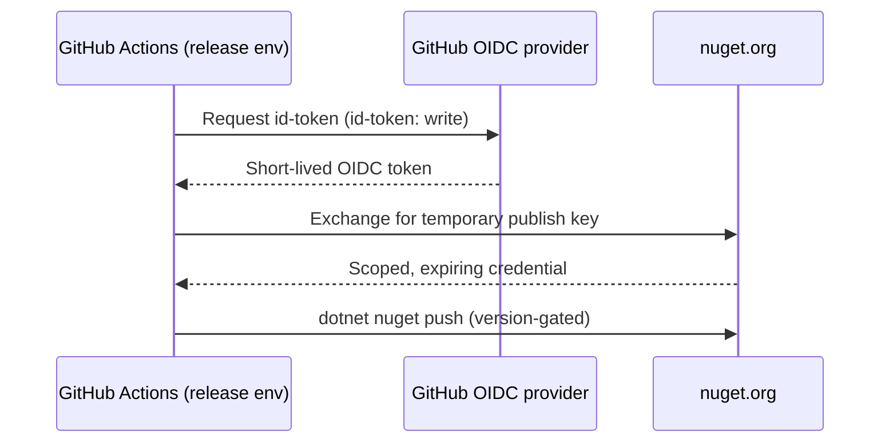
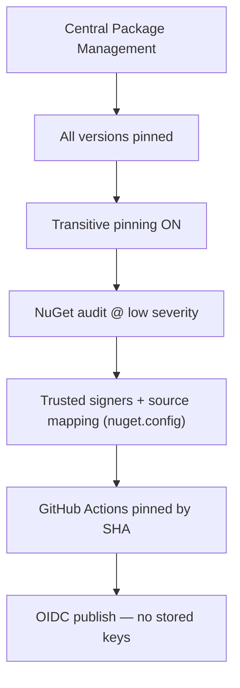
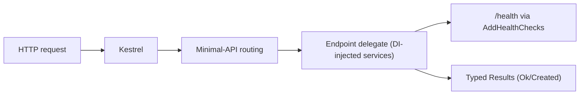

# Security — E128.Reference

> **One sentence:** Security here is build-time and supply-chain first — deny-by-default analysis, analyzer-enforced safe patterns (FIPS hashing, crypto-grade randomness, TOCTOU avoidance), OIDC publishing with no stored secrets, and pinned dependencies — since the reference apps themselves carry no auth surface.

*Updated: 2026-05-29T19:02:39Z*

---

## Authentication

The reference web and CLI apps implement **no end-user authentication** — they are demonstrators. The only authenticated flow is the release pipeline, which uses OIDC trusted publishing:

## Authorization

| Mechanism                     | Where                                                   |
| ----------------------------- | ------------------------------------------------------- |
| Workflow permissions          | `permissions: contents: read` baseline; `id-token: write` only in publish |
| `release` environment         | Gates the publish job (environment protection rules)    |
| Branch protection             | `main` gated by `ci.yml`                                |

## API Security

The reference web API demonstrates safe defaults rather than a full security stack:

| Control            | Status in reference                                              |
| ------------------ | ---------------------------------------------------------------- |
| Input model        | Typed `GreetingRequest` binding                                  |
| Cancellation       | `CancellationToken` threaded through all async endpoints         |
| Rate limiting/CORS | Not implemented (out of reference scope)                         |
| Health probe       | `GET /health` exposed                                            |

## Data Security — Analyzer-Enforced

The analyzer suite is itself a security control. Key security/reliability rules:

| Rule    | Protects against                                                      |
| ------- | --------------------------------------------------------------------- |
| E128071 | Non-FIPS hash algorithms (MD5, SHA1, DES, RC2, 3DES, HMAC-MD5/SHA1)   |
| E128075 | `System.Random` in crypto contexts → use `RandomNumberGenerator`      |
| E128011 | `[GeneratedRegex]` without timeout → catastrophic backtracking / ReDoS|
| E128013/E128014 | Overlapping / nested regex quantifiers → exponential backtracking |
| E128056 | `FileInfo.Exists` then read → TOCTOU race                             |
| E128064 | Disk write-then-read round-trip → TOCTOU window + redundant syscall   |
| E128023/E128025 | Hardcoded `/tmp`, predictable temp names                       |
| E128041 | `JsonDocument.RootElement` escaping `using` scope → use-after-free    |
| E128039/E128051 | Catch filters swallowing `OperationCanceledException`          |
| E128086 | `ArrayPool` buffer as SQLite param without `.Size` → garbage in BLOB  |

## Supply-Chain Security

| Control                          | File / mechanism                                  |
| -------------------------------- | ------------------------------------------------- |
| Version pinning                  | `Directory.Packages.props` (CPM)                  |
| Transitive pinning               | `CentralPackageTransitivePinningEnabled=true`     |
| Vulnerability auditing           | NuGet audit at `low` for direct + transitive      |
| Source restriction               | `nuget.config` `<packageSourceMapping>` + `<clear/>` |
| Signature verification           | `nuget.config` `<trustedSigners>`                 |
| Action pinning                   | Workflows reference actions by commit SHA         |
| No long-lived publish secret     | OIDC trusted publishing                           |

## Multi-Tenancy Security

Not applicable — single-tenant, stateless reference apps.

## Middleware / Request Pipeline

The reference pipeline is intentionally minimal: no auth/authz middleware is registered, keeping the demonstrator focused on idiomatic wiring rather than a production security stack.
