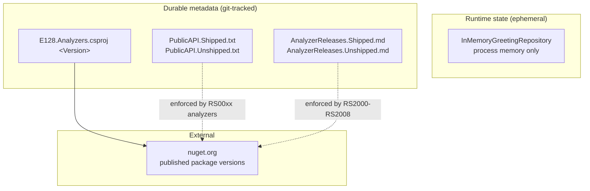
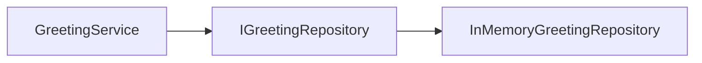
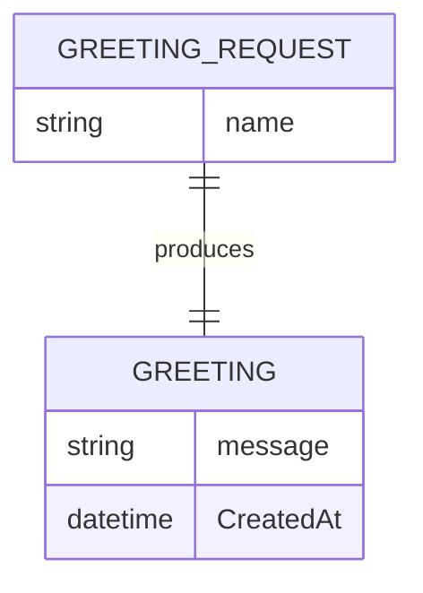

# Storage & State — E128.Reference

> **One sentence:** There is no database — runtime state is a single in-memory repository, while the durable, version-controlled "state" that matters is the analyzer's PublicAPI and release-tracking metadata files.

*Updated: 2026-05-29T19:02:39Z*

---

## Storage Landscape

## Data Model

| Concern              | Model                                                                 |
| -------------------- | --------------------------------------------------------------------- |
| Runtime persistence  | Per-tenant? No. Shared? N/A. In-memory, single-process, non-durable.  |
| Domain entities      | `Greeting` (and request/model types under `Core/Models`)              |
| No relational schema | The reference deliberately avoids a database to stay minimal          |

## Data Access Pattern

Runtime access is through the `IGreetingRepository` abstraction with `InMemoryGreetingRepository` as the only implementation, resolved via DI. There is no ORM, no connection string, and no SQL. The repository interface demonstrates the seam where a real persistence implementation would slot in.

## Key Database Objects

None. No appsettings.json connection strings, no migrations, no stored procedures are present in the repo.

## Schema Management (Analyzer Metadata)

The analyzer package treats its **public API and rule set as schema**, managed by Roslyn's own analyzers:

| Artifact                          | Managed by                                  | Rules            |
| --------------------------------- | ------------------------------------------- | ---------------- |
| `PublicAPI.Shipped.txt`           | `Microsoft.CodeAnalysis.PublicApiAnalyzers` | RS0016, RS0017…  |
| `PublicAPI.Unshipped.txt`         | same                                        | same             |
| `AnalyzerReleases.Shipped.md`     | Roslyn release-tracking analyzers           | RS2000–RS2008    |
| `AnalyzerReleases.Unshipped.md`   | same                                        | same             |

New rules and API are added to the `Unshipped` files; on release they migrate to `Shipped`. Validate with `scripts/internal/analyzer-release-check.sh`.

## Entity Relationships

(Indicative — the Core models are intentionally small; see `src/E128.Reference.Core/Models/`.)
