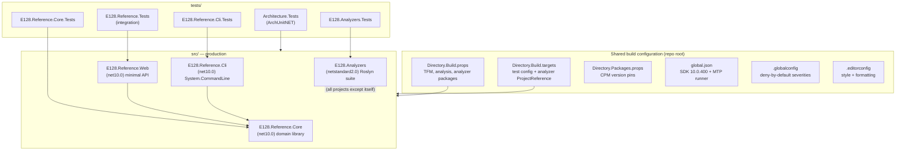
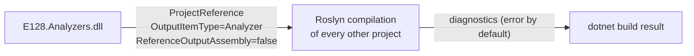
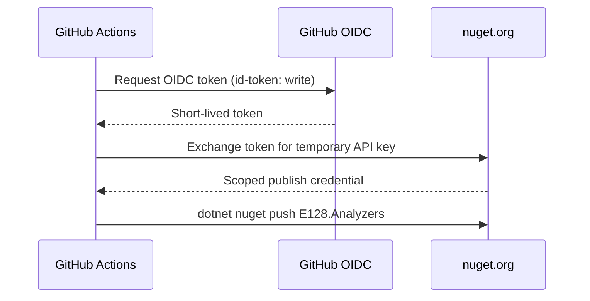
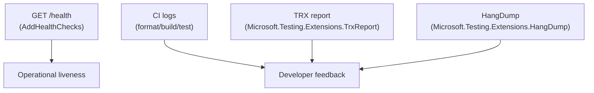

# System Architecture — E128.Reference

> **One sentence:** A single .NET 10 solution of four production projects (Core, Web, Cli, Analyzers) and five test projects, governed by shared MSBuild props and a build-time analyzer ProjectReference that analyzes every project except itself.

*Updated: 2026-05-29T19:02:39Z*

---

## Component Map

## Architectural Layers

### Layer 1 — Build & Analysis Configuration

The repository root holds all cross-cutting configuration. Every project inherits it; no project redefines it.

| File                      | Responsibility                                                            |
| ------------------------- | ------------------------------------------------------------------------- |
| `Directory.Build.props`   | TFM, language version, nullable, analysis level/mode, analyzer packages   |
| `Directory.Build.targets` | `IsTestProject` config (MTP, `OutputType=Exe`); analyzer `ProjectReference` |
| `Directory.Packages.props`| Central Package Management version pins                                   |
| `global.json`             | SDK pin (`10.0.400`) and MTP test runner selection                        |
| `.globalconfig`           | Analyzer diagnostic severities (blanket `error`)                          |
| `.editorconfig`           | Code style, formatting, naming, inline severity hints                     |

### Layer 2 — Production Code

| Project               | SDK                       | TFM              | Role                              |
| --------------------- | ------------------------- | ---------------- | --------------------------------- |
| `E128.Reference.Core` | `Microsoft.NET.Sdk`       | `net10.0`        | Shared domain library             |
| `E128.Reference.Web`  | `Microsoft.NET.Sdk.Web`   | `net10.0`        | Minimal-API web service (Kestrel) |
| `E128.Reference.Cli`  | `Microsoft.NET.Sdk`       | `net10.0`        | Console app (System.CommandLine)  |
| `E128.Analyzers`      | `Microsoft.NET.Sdk`       | `netstandard2.0` | Roslyn analyzer + code-fix suite  |

### Layer 3 — Tests

Five projects, each carrying `<IsTestProject>true</IsTestProject>` and inheriting MTP config. See [../engineering/testing-strategy.md](../engineering/testing-strategy.md).

## Inter-Service Communication

There is no runtime inter-service communication — the production apps are independent processes that share a library. The most important "communication" is at **build time**: the analyzer wires itself into every project's compilation.

Rules:
- The analyzer is referenced via `Directory.Build.targets`, gated on `IsRoslynComponent != true` so the analyzer does not analyze itself.
- The condition also checks the `.csproj` exists, so the solution still builds if the analyzer project is removed.

## Multi-Tenancy Model

Not applicable. The reference web service is single-tenant and stateless (in-memory store only).

## Authentication & Authorization

The reference apps implement **no authentication** — they are demonstrators. The security posture that matters is build-time and supply-chain (see [security.md](security.md)). The one authenticated flow in the system is the **release pipeline**:

## Observability Stack

The reference apps include a health endpoint; deeper telemetry (logging/metrics/tracing) is intentionally out of scope for the reference surface. Test observability comes from TRX reports and hang dumps in CI.

## Technology Decisions Summary

| Decision                          | Chosen                              | Alternatives considered                 |
| --------------------------------- | ----------------------------------- | --------------------------------------- |
| Web style                         | Minimal API                         | MVC controllers                         |
| CLI framework                     | System.CommandLine                  | Spectre.Console, raw args               |
| DI container                      | `Microsoft.Extensions.DependencyInjection` | none / manual wiring             |
| Test runner                       | Microsoft Testing Platform (xUnit v3)| VSTest (retired on .NET 10)            |
| Architecture enforcement          | ArchUnitNET                         | convention-only / code review           |
| Analyzer TFM                      | `netstandard2.0`                    | `net10.0`                               |
| Package management                | CPM + transitive pinning            | per-project versions                    |
| Solution format                   | `.slnx` (XML)                       | legacy `.sln` (GUID-based)              |
