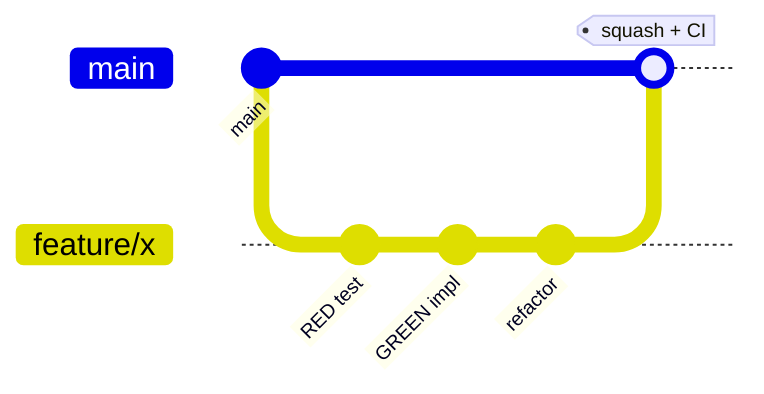

# Getting Started — E128.Reference

> **One sentence:** Install the pinned .NET 10 SDK, then use the repo's deterministic `scripts/*.sh` wrappers — never raw `dotnet` commands — to build, test, and verify.

*Updated: 2026-05-29T19:02:39Z*

---

## Prerequisites

| Tool                          | Version / note                                            |
| ----------------------------- | --------------------------------------------------------- |
| .NET SDK                      | `10.0.203` (pinned in `global.json`)                      |
| `rg` (ripgrep)                | Required — fast search used by scripts                    |
| `fd`                          | Required — fast file finder                               |
| `jq`                          | Required — parses script JSON output                      |
| `bash`                        | 5+ (associative arrays, modern features)                  |
| Docker                        | Optional — only for the web-service container path        |
| `jb` (JetBrains CLI tools)    | Optional — `dotnet tool install -g JetBrains.ReSharper.GlobalTools`; format gracefully skips if absent |
| `shellcheck`                  | Optional — lints `scripts/*.sh`                           |

Confirm the SDK: `scripts/sdk-version.sh` (reads `global.json`). Confirm it is installed: `dotnet --list-sdks`.

## Repository Setup

```bash
git clone <repo-url> dotnet-reference
cd dotnet-reference
```

All cross-cutting configuration is inherited from the repo root (`Directory.Build.props`, `.globalconfig`, `Directory.Packages.props`) — no per-project setup is needed.

## Building & Running

> **Use the scripts.** Raw `dotnet build/test/format` are disallowed by repo convention; the scripts give terse JSON output and enforce the MTP test path.

```bash
scripts/build.sh                 # build the whole solution (add --verbose for full MSBuild)
scripts/build.sh --project Web   # build a single project
scripts/test.sh                  # CI-trait tests (fast)
scripts/test.sh GreeterTests     # one test class (targeted)
scripts/test.sh --all            # full suite incl. Docker/Manual
scripts/check.sh                 # composed: format → build → targeted tests
scripts/ci.sh                    # full CI: format + build + test
```

Run the web service and CLI:

```bash
dotnet run --project src/E128.Reference.Web   # GET / , POST/GET /greetings , /health
dotnet run --project src/E128.Reference.Cli   # System.CommandLine root
scripts/docker.sh                              # build/run/test the web container
```

## Architecture Quick Reference

```
├── Directory.Build.props / .targets   # shared MSBuild props + test/analyzer wiring
├── Directory.Packages.props           # CPM version pins
├── global.json                        # SDK 10.0.203 + MTP runner
├── .globalconfig / .editorconfig      # severities / style
├── src/
│   ├── E128.Reference.Core/           # domain library (Greeter, models, services, repos)
│   ├── E128.Reference.Web/            # minimal API (Program.cs)
│   ├── E128.Reference.Cli/            # System.CommandLine
│   └── E128.Analyzers/                # Roslyn analyzers (netstandard2.0)
├── tests/                             # 5 test projects
├── scripts/                           # deterministic bash wrappers
└── .github/workflows/                 # ci.yml + publish.yml
```

## Key Patterns

**Dependency injection + TimeProvider** (from `Web/Program.cs`):

```csharp
builder.Services.AddSingleton<Greeter>();
builder.Services.AddSingleton(TimeProvider.System);   // never DateTime.Now (E128003)
builder.Services.AddSingleton<IGreetingRepository, InMemoryGreetingRepository>();
builder.Services.AddSingleton<IGreetingService, GreetingService>();
```

**Cancellation threaded through async endpoints**:

```csharp
app.MapPost("/greetings", async (GreetingRequest request, IGreetingService service, CancellationToken cancellationToken) =>
{
    var greeting = await service.GreetAsync(request, cancellationToken);
    return Results.Created(/* ... */, greeting);
});
```

**Explicit usings** — implicit usings are disabled; every file declares its `using` directives.

## Development Workflow



1. Branch (`feature/`, `fix/`, `refactor/`).
2. TDD: write a failing test (`Assert.Fail("message")` stub) → implement → refactor.
3. `scripts/format.sh --changed` then `scripts/check.sh --no-format`.
4. Squash to one commit; push (CI gates the merge).
5. Analyzer source changes additionally trigger `publish.yml`.
