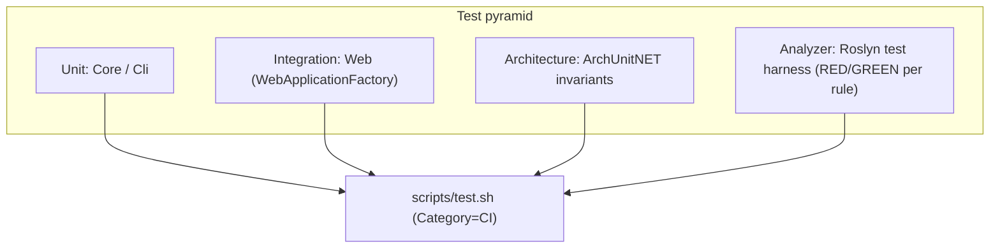

# Testing Strategy — E128.Reference

> **One sentence:** xUnit v3 on the Microsoft Testing Platform, with five test projects spanning unit, web-integration, architecture-invariant, and Roslyn analyzer/code-fix verification — all category-trait filtered and gated by deny-by-default analysis.

*Updated: 2026-05-29T19:02:39Z*

---

## Test Projects

| Project                     | What it verifies                          | Notable packages (beyond `xunit.v3.mtp-v2`)                                   |
| --------------------------- | ----------------------------------------- | ------------------------------------------------------------------------------ |
| `E128.Reference.Core.Tests` | Core domain logic                         | —                                                                              |
| `E128.Reference.Cli.Tests`  | CLI behavior                              | —                                                                              |
| `E128.Reference.Tests`      | Web endpoints (integration)               | `Microsoft.AspNetCore.Mvc.Testing`, `Microsoft.Extensions.Diagnostics.Testing` |
| `Architecture.Tests`        | Structural invariants (IL analysis)       | `TngTech.ArchUnitNET.xUnitV3`                                                   |
| `E128.Analyzers.Tests`      | Each analyzer + its code fix              | `Microsoft.CodeAnalysis.CSharp.Analyzer.Testing`, `…CodeFix.Testing`           |

All five carry `<IsTestProject>true</IsTestProject>` and inherit the MTP configuration (`UseMicrosoftTestingPlatformRunner`, `OutputType=Exe`) from `Directory.Build.targets`.



## Testing Patterns

**Naming**: `Method_Condition_Result` (e.g., `Greet_ReturnsGreeting_WithDefaultName`).

**No reflection** — use `internal` + `InternalsVisibleTo`. The Web project exposes its generated `Program` to the integration test project this way.

**RED-phase stubs** use `Assert.Fail("message")` — never `Assert.True(false, ...)` or `throw new NotImplementedException()`.

**Category traits** — every test method carries `[Trait("Category", "...")]`; the analyzer `E128073` enforces this.

```csharp
[Fact]
[Trait("Category", "CI")]
public async Task GreetAsync_PersistsGreeting_AndReturnsCreated()
{
    // Arrange / Act / Assert
}
```

**Integration via WebApplicationFactory**:

```csharp
await using var factory = new WebApplicationFactory<Program>();
var client = factory.CreateClient();
var response = await client.GetAsync("/health");
```

**Analyzer tests** use the Roslyn `CSharpAnalyzerVerifier`/`CSharpCodeFixVerifier` harnesses, one test class per rule (e.g., `E128064DiskRoundtripAnalyzerTests`).

## CI/CD Quality Gates

| Gate                 | Command (local)                          | Enforced by                          |
| -------------------- | ---------------------------------------- | ------------------------------------ |
| Format               | `scripts/format.sh --check`              | `ci.yml` `dotnet format --verify-no-changes` |
| Build (no warnings)  | `scripts/build.sh`                       | `TreatWarningsAsErrors=true`         |
| Deny-by-default rules| (during build)                           | `.globalconfig` blanket `error`      |
| CI tests             | `scripts/test.sh`                        | `ci.yml` `--filter-trait Category=CI`|
| Architecture         | `scripts/test.sh Architecture.Tests` (or `--all`) | ArchUnitNET assertions       |
| Release-file hygiene | `scripts/internal/analyzer-release-check.sh` | RS2000–RS2008                    |

## Test Categories

| Category | Purpose                                  | Runs in CI |
| -------- | ---------------------------------------- | ---------- |
| `CI`     | Fast, deterministic, no external deps    | Yes        |
| `Docker` | Requires Docker daemon                    | No         |
| `Manual` | Requires manual/external setup            | No         |

## Test Coverage — Honest Assessment

| Area              | Coverage posture                                                            |
| ----------------- | --------------------------------------------------------------------------- |
| `E128.Analyzers`  | High — one RED/GREEN test class per rule is the development norm; the largest test project by far |
| `E128.Reference.Core` | Adequate for the small surface (Greeter/Service/Repository)             |
| `E128.Reference.Web`  | Endpoint-level integration coverage via `WebApplicationFactory`         |
| `E128.Reference.Cli`  | Light — small surface                                                    |
| Architecture      | Invariants (layering, naming, sealed-by-default) verified via IL analysis   |

Estimate coverage by namespace with `scripts/coverage-areas.sh`.
