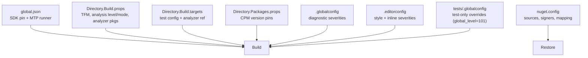

# Configuration — E128.Reference

> **One sentence:** Configuration is build-time first — MSBuild props, `.editorconfig`, and `.globalconfig` govern the solution, while consumers of the analyzer package tune individual rule severities in their own `.editorconfig`.

*Updated: 2026-05-29T19:02:39Z*

---

## Configuration Sources



## Key MSBuild Properties (`Directory.Build.props`)

| Property                          | Value             | Effect                                            |
| --------------------------------- | ----------------- | ------------------------------------------------- |
| `AnalysisLevel`                   | `latest-all`      | Enable the latest analyzer rule set               |
| `AnalysisMode`                    | `Recommended`     | Baseline mode; per-category overrides below       |
| `AnalysisModeSecurity`            | `All`             | All security rules on                             |
| `AnalysisModeReliability`         | `All`             | All reliability rules on                          |
| `AnalysisModePerformance`         | `All`             | All performance rules on                          |
| `EnableNETAnalyzers`              | `true`            | .NET analyzers active                             |
| `EnforceCodeStyleInBuild`         | `true`            | IDE* rules fire during build                      |
| `TreatWarningsAsErrors`           | `true`            | Any warning fails the build                       |
| `ManagePackageVersionsCentrally`  | `true`            | CPM on                                            |
| `CentralPackageTransitivePinningEnabled` | `true`     | Pin transitive versions                           |
| `CentralPackageVersionOverrideEnabled`   | `false`    | Forbid per-project overrides                      |
| `ImplicitUsings`                  | `disable`         | Every file declares explicit `using`s             |

## Severity Configuration

Three files, by responsibility ([details in lode/dotnet/analyzers.md](../../lode/dotnet/analyzers.md)):

| File                  | Owns                                          | Scope              |
| --------------------- | --------------------------------------------- | ------------------ |
| `.editorconfig`       | Style/formatting/naming + inline severities   | All projects       |
| `.globalconfig`       | `dotnet_diagnostic.*` severities + enabling    | All projects       |
| `tests/.globalconfig` | Test-only relaxations (`global_level=101`)     | Test projects only |

Blanket rule: `.globalconfig` sets `dotnet_analyzer_diagnostic.severity = error`. Overrides are explicit.

### Tuning E128.Analyzers (as a consumer)

```ini
# .editorconfig in the consuming repo

# Promote a rule to error
dotnet_diagnostic.E128008.severity = error

# Disable a rule
dotnet_diagnostic.E128005.severity = none

# E128062: which TFM is "current"
e128_minimum_framework_version = 100
```

### ConfigureAwait scoping (CA2007 + E128022)

```ini
dotnet_diagnostic.CA2007.severity = error
dotnet_code_quality.CA2007.output_kind = DynamicallyLinkedLibrary  # libraries only
# E128022 flags ConfigureAwait(false) in app code (Exe projects)
```

## Common Test-Project Overrides (`tests/.globalconfig`)

| Rule      | Reason                                              |
| --------- | --------------------------------------------------- |
| CA1515    | xUnit requires public test types                    |
| CA1707    | Underscores in test method names                    |
| CA1062    | xUnit fixture injection is non-null                 |
| CA2007    | `ConfigureAwait` not needed in tests                |
| MA0040    | Ambient `CancellationToken` too noisy               |
| E128064   | Fixtures legitimately round-trip through disk       |
| VSTHRD200 | Test methods don't need `Async` suffix              |

## Environment-Specific Overrides

The reference apps carry no per-environment config (no `appsettings.{Environment}.json`, no connection strings). Environment variation lives in CI (`ci.yml` sets `DOTNET_*` flags) and Docker (Alpine base image tags pinned to `10.0-alpine`).

## Secrets vs Config

| Item                    | Classification                                  |
| ----------------------- | ----------------------------------------------- |
| SDK version, TFM        | Config (`global.json`, props)                   |
| Package versions        | Config (`Directory.Packages.props`)             |
| Rule severities         | Config (`.globalconfig` / `.editorconfig`)      |
| NuGet publish credential| Secret — issued via OIDC at publish time only   |
| Application secrets      | None present                                    |
