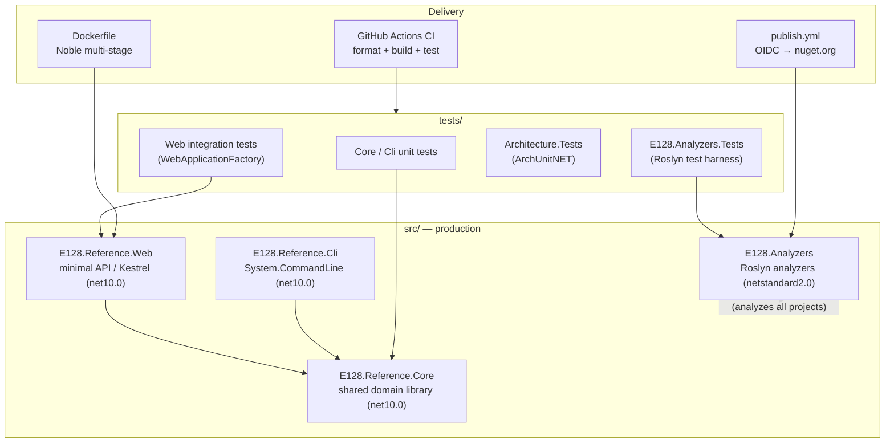

# E128.Reference — Documentation Wiki

> **One sentence:** A .NET 10 reference repository that demonstrates modern conventions end-to-end — minimal-API web service, System.CommandLine CLI, a NuGet-packable Roslyn analyzer suite, deny-by-default code analysis, xUnit v3 + MTP testing, ArchUnitNET structural tests, and a Claude Code automation harness.

*Updated: 2026-05-29T19:02:39Z*

---

## Semantic Index — Start Here

| I am a...                  | I want to...                                          | Go to                                                              |
| -------------------------- | ----------------------------------------------------- | ------------------------------------------------------------------ |
| Executive / sponsor        | Understand business value and risk                    | [overview/executive.md](overview/executive.md)                     |
| Architect / staff engineer | See strategic trade-offs and positioning              | [overview/strategy.md](overview/strategy.md)                       |
| Product manager            | Understand features and user-facing capability        | [overview/product.md](overview/product.md)                         |
| New engineer               | Build and run the repo locally                         | [engineering/getting-started.md](engineering/getting-started.md)   |
| Engineer (orientation)     | Learn what every project does                          | [engineering/codebase-map.md](engineering/codebase-map.md)         |
| Systems architect          | Understand the component topology                      | [architecture/system.md](architecture/system.md)                   |
| Backend engineer           | Trace how a request/data flows                         | [architecture/data-flow.md](architecture/data-flow.md)             |
| Platform / DevOps engineer | Understand CI/CD and publishing                        | [architecture/deployment.md](architecture/deployment.md)           |
| Security reviewer          | Audit auth, secrets, and analyzer-enforced safety      | [architecture/security.md](architecture/security.md)               |
| Tooling engineer           | Understand the analyzer rule set                       | [architecture/integration-patterns.md](architecture/integration-patterns.md) |
| QA / test engineer         | Understand the test strategy and gates                 | [engineering/testing-strategy.md](engineering/testing-strategy.md) |
| Anyone configuring it      | Find configuration knobs and severity overrides        | [guides/configuration.md](guides/configuration.md)                 |
| Anyone needing a term      | Look up domain vocabulary                              | [reference/glossary.md](reference/glossary.md)                     |
| CLI user                   | Run the reference CLI / project scripts                | [reference/cli-commands.md](reference/cli-commands.md)             |

---

## Pyramid Summary

### Level 1 — One Sentence

A self-contained .NET 10 reference codebase that proves out modern build, test, analysis, and delivery conventions — and ships a real Roslyn analyzer package (`E128.Analyzers`) to nuget.org.

### Level 2 — One Paragraph

E128.Reference is a single-repository, multi-project .NET 10 solution. Three small production projects (a `Core` domain library, a minimal-API `Web` service, and a System.CommandLine `Cli`) demonstrate idiomatic application code, while a fourth production project — `E128.Analyzers` — is a substantial, independently published Roslyn analyzer suite (90 diagnostic IDs, 85 analyzers, 78 code fixes as of 2026-05-29) that enforces the very conventions the rest of the repo follows. The whole solution runs under deny-by-default code analysis (`TreatWarningsAsErrors`, blanket `error` severity), Central Package Management with transitive pinning, xUnit v3 on the Microsoft Testing Platform, and ArchUnitNET structural invariant tests. Delivery is automated: GitHub Actions runs format+build+test on every push and OIDC trusted-publishes the analyzer package; a Claude Code harness (CLAUDE.md, rules, hooks, skills, agents, bash scripts) governs day-to-day development.

### Level 3 — Key Capabilities

- **Reference application stack** — minimal-API web service (Kestrel) + System.CommandLine CLI sharing a common `Core` library wired through DI.
- **E128.Analyzers** — a NuGet-packable Roslyn analyzer + code-fix suite spanning Design, Reliability, Performance, Security, Style, and Testing categories.
- **Deny-by-default analysis** — `.globalconfig` sets every diagnostic to `error`; relaxations are explicit and justified.
- **Modern test platform** — xUnit v3 with MTP (no VSTest), category-trait filtering, ArchUnitNET IL-level architecture tests, Roslyn analyzer/code-fix test harnesses.
- **Central Package Management** — all versions pinned in `Directory.Packages.props`, transitive pinning on, NuGet audit at `low`.
- **Hardened containerization** — multi-stage Noble Dockerfile, built and run via Podman.
- **Automated delivery** — CI on `ubuntu-24.04`; OIDC trusted publishing to nuget.org with a version-exists gate.
- **AI development harness** — deterministic bash scripts, Claude Code rules, skills, and agents.

### Level 4 — Architecture at a Glance



### Level 5 — Go Deeper

- System topology and layers → [architecture/system.md](architecture/system.md)
- The analyzer suite (the repo's flagship) → [architecture/integration-patterns.md](architecture/integration-patterns.md)
- Build, run, and contribute → [engineering/getting-started.md](engineering/getting-started.md)
- Every project explained → [engineering/codebase-map.md](engineering/codebase-map.md)
- CI/CD and trusted publishing → [architecture/deployment.md](architecture/deployment.md)

---

## Document Map

```
docs/
├── index.md                       # ← you are here (pyramid entry point)
├── overview/
│   ├── executive.md               # Business value, risk, investment
│   ├── strategy.md                # Positioning and trade-offs
│   └── product.md                 # Features, personas, journeys
├── architecture/
│   ├── system.md                  # Component topology and layers
│   ├── data-flow.md               # Request + greeting data flow
│   ├── storage.md                 # State model (in-memory) and analyzer metadata
│   ├── deployment.md              # CI/CD, Podman, OIDC publishing
│   ├── integration-patterns.md    # The E128.Analyzers rule catalog
│   └── security.md                # Auth, secrets, analyzer-enforced safety
├── engineering/
│   ├── getting-started.md         # Prerequisites, build, run
│   ├── codebase-map.md            # Project inventory + dependency graph
│   └── testing-strategy.md        # Test projects, patterns, gates
├── guides/
│   └── configuration.md           # Config sources, severity overrides
└── reference/
    ├── glossary.md                # Terminology and acronyms
    └── cli-commands.md            # CLI + scripts/*.sh reference
```

---

## What Is This?

E128.Reference is not a product shipped to end customers — it is a **canonical reference implementation** owned by the engineering organization. Its purpose is to encode "how we build .NET" into runnable, test-verified, analyzer-enforced code so that new services can be bootstrapped from a known-good baseline and existing services can be measured against it. The one externally consumed artifact is the `E128.Analyzers` NuGet package, which carries the repo's conventions into any consuming codebase as compile-time diagnostics.
