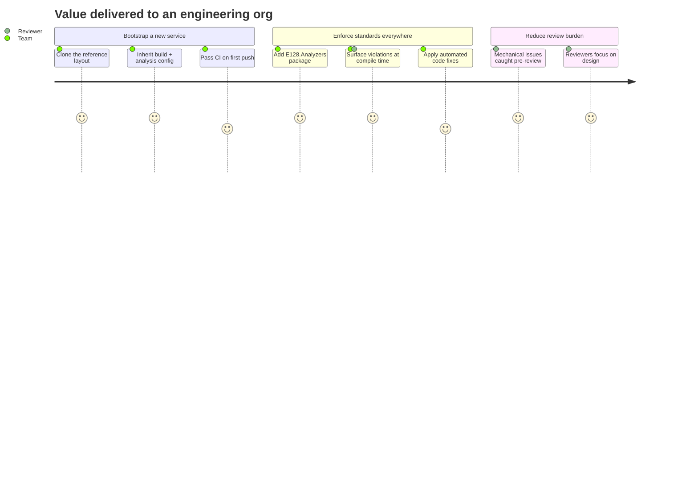

# Executive Overview — E128.Reference

> **One sentence:** A reference codebase that lowers the cost and risk of building new .NET services by encoding the organization's engineering standards into runnable, analyzer-enforced code — and ships those standards as a reusable NuGet package.

*Updated: 2026-05-29T19:02:39Z*

---

## The Problem

Engineering teams re-litigate the same decisions on every new service: which test runner, how to manage package versions, how strict to make code analysis, how to package and publish, what "good" .NET looks like. The result is drift — every repo is subtly different, onboarding is slow, and code review spends its time on mechanical issues (a forgotten `ConfigureAwait`, an `async void`, a hardcoded `/tmp`) instead of on design. Conventions written in a wiki are ignored because nothing enforces them.

## The Solution

E128.Reference is a single, runnable repository that **is** the standard. It demonstrates the full stack — application code, tests, build configuration, containerization, and CI/CD — and it ships `E128.Analyzers`, a Roslyn analyzer package that turns those conventions into compile-time errors in any consuming codebase. Standards stop being documents and become build failures.

## Business Capabilities

## Technical Architecture in Plain English

The repository contains four small "application" pieces and one large "tooling" piece. The application pieces — a web service, a command-line tool, and a shared library — are intentionally minimal; their job is to show the right way to wire things up, not to do real work. The tooling piece, `E128.Analyzers`, is the substance: a library of ~90 automated checks (with most carrying an automatic one-click fix) that watch for risky or non-idiomatic C# and flag it as you type or build. Everything is verified by an automated test suite and shipped automatically when changes land.

## Key Risks & Mitigations

| Risk                                              | Likelihood | Mitigation                                                                 |
| ------------------------------------------------- | ---------- | -------------------------------------------------------------------------- |
| Standards drift from current .NET guidance        | Medium     | Renovate auto-updates dependencies; analyzers track latest Roslyn          |
| Analyzer change breaks consumer builds            | Medium     | PublicAPI tracking, full test suite, version-gated publish                 |
| SDK rolls to an untested major version            | Low        | `global.json` pins `10.0.400` (note: `rollForward: latestMajor` is broad)  |
| Secrets leak via publishing pipeline              | Low        | OIDC trusted publishing — no stored NuGet API keys                         |
| Over-strict analysis blocks legitimate code       | Medium     | Per-rule severity overrides + documented test-project relaxations          |

## Compliance Posture

- **No stored credentials** — NuGet publishing uses OIDC token exchange, not long-lived keys.
- **Supply-chain controls** — Central Package Management with transitive pinning; NuGet audit active at `low` severity; trusted-signer and source-mapping config.
- **FIPS-aware** — analyzer `E128071` flags non-FIPS hash algorithms; `E128075` flags non-cryptographic randomness in security contexts.
- **Reproducible builds** — pinned SDK, pinned base images, pinned GitHub Actions (by commit SHA).

## Technology Investment Summary

| Investment                       | Rationale                                                                 |
| -------------------------------- | ------------------------------------------------------------------------- |
| Custom Roslyn analyzer suite     | Highest leverage — enforces standards in every consuming repo, not just here |
| Deny-by-default code analysis    | Catches defects at compile time; cheapest place to fix them                |
| xUnit v3 + Microsoft Testing Platform | Aligns with the supported .NET 10 test path (VSTest is retired)        |
| ArchUnitNET architecture tests   | Prevents architectural erosion that unit tests cannot catch                |
| OIDC trusted publishing          | Removes credential-management risk from the release path                   |
| Claude Code automation harness   | Makes the conventions cheap to follow during day-to-day development        |
