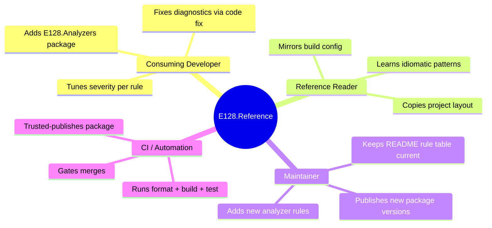
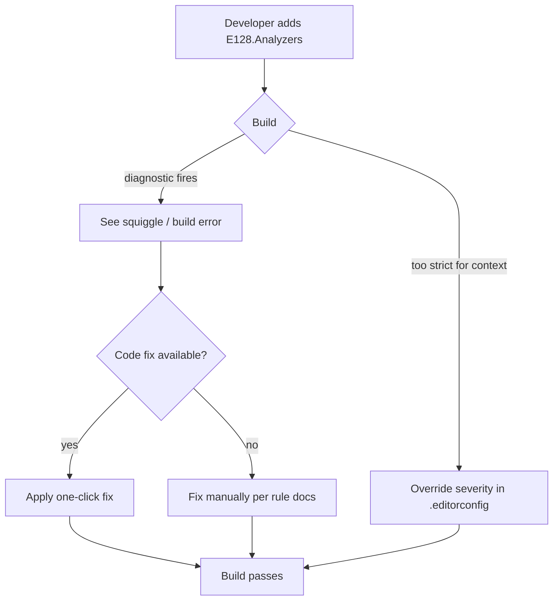
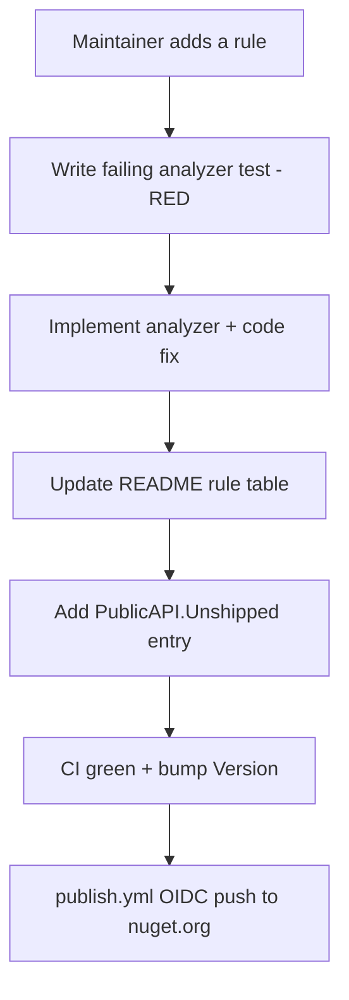

# Product View — E128.Reference

> **One sentence:** The product surface is the analyzer suite consumed by developers, plus a thin reference web/CLI app that demonstrates the patterns those analyzers enforce.

*Updated: 2026-05-29T19:02:39Z*

---

## Personas

## Feature Domains

### Analyzer Rules (the core product)

| Domain      | What it enforces                                                              | Example rules                          |
| ----------- | ----------------------------------------------------------------------------- | -------------------------------------- |
| Design      | Sealed-by-default, DI correctness, immutability, unit-safe types              | E128005, E128032, E128061, E128050     |
| Reliability | Regex safety, TOCTOU races, disk round-trips, cancellation, JSON lifetime     | E128011, E128056, E128064, E128039     |
| Performance | O(n²) loop patterns, allocation reduction, frozen collections                 | E128066, E128027, E128009, E128083     |
| Security    | FIPS hashing, cryptographic randomness                                        | E128071, E128075                       |
| Style       | `string.Empty`, UTF-8 encoding, pragma hygiene, rename artifacts              | E128002, E128006, E128063, E128047     |
| Testing     | Temp-dir cleanup, current reference assemblies, category traits               | E128054, E128062, E128073              |

Full catalog with code-fix status: [../architecture/integration-patterns.md](../architecture/integration-patterns.md).

### Reference Web Service

| Feature            | Surface                                       |
| ------------------ | --------------------------------------------- |
| Greeting (root)    | `GET /` → returns a greeting                  |
| Create greeting    | `POST /greetings` → persists, returns 201     |
| List greetings     | `GET /greetings?count=N` → recent greetings   |
| Health             | `GET /health` → health check endpoint         |

### Reference CLI

| Feature            | Surface                                       |
| ------------------ | --------------------------------------------- |
| Root command       | System.CommandLine root, DI-backed            |

## Key User Journeys

## Feature Matrix by Role

| Capability                          | Consuming Dev | Reference Reader | Maintainer | CI |
| ----------------------------------- | ------------- | ---------------- | ---------- | -- |
| Compile-time diagnostics            | ✅            | ✅               | ✅         | ✅ |
| One-click code fixes                | ✅            | —                | ✅         | —  |
| Per-rule severity override          | ✅            | ✅               | ✅         | —  |
| Project layout / build config       | —             | ✅               | ✅         | ✅ |
| Add/modify analyzer rules           | —             | —                | ✅         | —  |
| Publish package                     | —             | —                | ✅ (via CI)| ✅ |

## Supported Systems

| Integration       | Detail                                                        |
| ----------------- | ------------------------------------------------------------- |
| Roslyn hosts      | Visual Studio 2022 17.8+, Rider 2024.1+, `dotnet build` CLI   |
| Package registry  | nuget.org (`E128.Analyzers`)                                  |
| CI                | GitHub Actions (`ubuntu-24.04`)                               |
| Container runtime | Alpine .NET 10 images (web service)                           |
