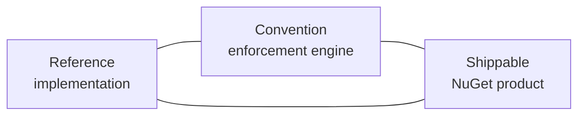

# Strategy & Positioning — E128.Reference

> **One sentence:** The repository's strategic bet is that conventions enforced by tooling beat conventions written in documents — so it invests disproportionately in a shippable analyzer suite and keeps the application code deliberately thin.

*Updated: 2026-05-29T19:02:39Z*

---

## Strategic Positioning

E128.Reference sits at the intersection of three roles:

- As a **reference implementation**, it shows idiomatic .NET 10 (minimal API, System.CommandLine, DI, immutability).
- As a **convention enforcement engine**, its `.globalconfig`, `Directory.Build.props`, and custom analyzers define and enforce "the standard."
- As a **shippable product**, `E128.Analyzers` carries that standard outward to any consuming codebase.

The investment is lopsided on purpose: ~24k LOC of analyzer source vs. ~200 LOC of application source. The application exists to be analyzed; the analyzer is the deliverable.

## Key Trade-offs

| Choice                                          | Rationale                                                                 | Alternative considered                                  |
| ----------------------------------------------- | ------------------------------------------------------------------------- | ------------------------------------------------------- |
| Custom analyzers over docs-only conventions     | Compile-time enforcement is unignorable and zero-friction at review time  | Wiki guidelines + manual review (drifts, ignored)       |
| Deny-by-default (`error`) severity              | Forces conventions to be met, not aspired to                              | Warning-default (gradually ignored as noise)            |
| `netstandard2.0` for the analyzer               | Maximum Roslyn host compatibility (VS, Rider, CLI, older SDKs)            | `net10.0` (smaller reach, simpler polyfills)            |
| Single repo, shared build props                 | One source of truth for TFM, analysis, and packages                       | Multiple repos (duplication, drift)                     |
| xUnit v3 + MTP                                  | The supported test path on .NET 10; VSTest is retired                     | Stay on xUnit v2 + VSTest (dead end)                    |
| Central Package Management + transitive pinning | Eliminates version drift and surprise transitive upgrades                 | Per-project `Version=` attributes                       |
| OIDC trusted publishing                         | Removes long-lived secrets from the release path                          | Stored NuGet API key in repo secrets                    |
| Minimal API over MVC controllers                | Less ceremony; matches modern .NET guidance for small services            | MVC controllers (heavier, more abstraction)             |
| Implicit usings **disabled**                    | Forces explicit, auditable dependency surface per file                    | Implicit usings (terser, less explicit)                 |

## Competitive Landscape

This is an internal asset, not a market product — but `E128.Analyzers` competes for mindshare against established third-party analyzer packages (Meziantou.Analyzer, Roslynator, SonarAnalyzer, SharpSource). Its differentiation is **complementarity, not replacement**: the repo runs all of those analyzers alongside its own, and `E128.Analyzers` fills gaps they leave (e.g., disk write-then-read round-trips, mid-name underscore rename artifacts, O(n²) loop patterns, `ByteSize`/`TimeSpan` unit-safety) rather than re-implementing existing rules.

## Growth Vectors

- **More analyzer rules** — the rule IDs grow monotonically (`E128001…E128090`); each new convention becomes a new rule with a test and a README entry.
- **Adoption breadth** — every team that adds the NuGet package inherits the standard, multiplying leverage.
- **Application surface** — the thin Web/Cli/Core projects can grow to demonstrate additional patterns (messaging, persistence, auth) as reference needs expand.
- **Harness maturity** — the Claude Code skills/agents/scripts layer compounds: each new deterministic script reduces future friction.
