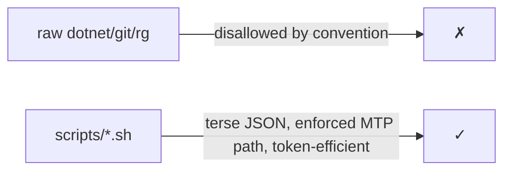

# Command Reference — E128.Reference

> **One sentence:** Day-to-day work goes through deterministic `scripts/*.sh` wrappers, not raw `dotnet`/`git` — this page lists the canonical scripts and common workflows.

*Updated: 2026-05-29T19:02:39Z*

---

## Why Scripts, Not Raw Commands



Discover everything with `scripts/help.sh`. Below are the most-used scripts.

## Core Script Table

| Task                  | Script                                              | Notes                                   |
| --------------------- | --------------------------------------------------- | --------------------------------------- |
| Build                 | `scripts/build.sh [--verbose] [--project NAME]`     | Terse JSON; `--verbose` for full log    |
| Test (CI trait)       | `scripts/test.sh [ClassName]`                       | Targeted by class; MTP runner           |
| Test (full suite)     | `scripts/test.sh --all`                             | Includes Docker/Manual                  |
| Format (apply)        | `scripts/format.sh --changed`                       | `jb cleanupcode` + `dotnet format`      |
| Format (check)        | `scripts/format.sh --check`                         | Verify-only (skips `jb`)                |
| Composed verify       | `scripts/check.sh [--all] [--no-format]`            | format → build → tests                  |
| Full CI               | `scripts/ci.sh`                                     | Mirrors `ci.yml`                        |
| Session context       | `scripts/context.sh`                                | status + diff + plans                   |
| Git status            | `scripts/status.sh [--json]`                        | Structured                              |
| Diff summary          | `scripts/diff.sh [--json] [--staged]`               | Structured                              |
| Branch info           | `scripts/branch.sh [--json]`                        | Ahead count, commits                    |
| Timestamp             | `scripts/ts.sh [FILE]`                              | ISO 8601 UTC                            |
| SDK version           | `scripts/sdk-version.sh [--json]`                   | Reads `global.json`                     |
| Analyzer stats        | `scripts/analyzer-stats.sh [--json]`                | Rule/fix/API counts                     |
| Analyzer context      | `scripts/analyzer-context.sh [--json]`              | Version, rules, fixes, public API       |
| Codebase stats        | `scripts/codebase-stats.sh [--json]`                | Files/LOC per project                   |
| Find symbol           | `scripts/find.sh --class\|--method\|--callers NAME` | Deterministic lookup                    |
| File outline          | `scripts/file-outline.sh PATH [--json]`             | Structure + line ranges                 |
| Extract source        | `scripts/code-read.sh --method\|--class NAME PATH`  | One symbol's source                     |
| Type deps             | `scripts/deps.sh TYPE [--callers] [--json]`         | Dependency graph                        |
| Dependency check      | `scripts/dep-check.sh [--outdated] [--vulnerable] [--json]` | NuGet health                    |
| Docker                | `scripts/docker.sh`                                 | Build/run/test web container            |
| Violation scan        | `scripts/violation-scan.sh`                         | Anti-pattern scan                       |
| Ship                  | `/yeet` (skill)                                     | Preflight + commit + push               |

Internal scripts (invoked by skills/agents) live under `scripts/internal/` — e.g., `analyzer-release-check.sh`, `version-bump.sh`, `precommit.sh`.

## Reference Application Commands

| Action                | Command                                              |
| --------------------- | ---------------------------------------------------- |
| Run web service       | `dotnet run --project src/E128.Reference.Web`        |
| Run CLI               | `dotnet run --project src/E128.Reference.Cli`        |
| Hit an endpoint       | `curl localhost:<port>/` · `/greetings` · `/health`  |

The Web service exposes `GET /`, `POST /greetings`, `GET /greetings?count=N`, and `GET /health`. The CLI is a System.CommandLine root command (`CliApp.CreateRootCommand`).

## Common Workflows

**1. Make a change, then verify**
```bash
scripts/format.sh --changed
scripts/check.sh --no-format
```

**2. Targeted TDD loop on one analyzer**
```bash
scripts/test.sh E128064DiskRoundtripAnalyzerTests   # RED
# implement
scripts/test.sh E128064DiskRoundtripAnalyzerTests   # GREEN
```

**3. Add a new analyzer rule**
```bash
# write RED test → implement analyzer + fix → update README rule table
# add PublicAPI.Unshipped.txt + AnalyzerReleases.Unshipped.md entries
scripts/internal/analyzer-release-check.sh
scripts/internal/version-bump.sh E128.Analyzers
scripts/ci.sh
```

**4. Pre-ship check**
```bash
scripts/ci.sh        # or: /yeet --dry-run
```

**5. Inspect the codebase without reading whole files**
```bash
scripts/find.sh --class GreetingService
scripts/code-read.sh --method GreetAsync src/E128.Reference.Core/Services/GreetingService.cs
scripts/file-outline.sh src/E128.Analyzers/Reliability/DiskRoundtripAnalyzer.cs
```

**6. Check dependency health**
```bash
scripts/dep-check.sh --outdated --vulnerable --json
```

**7. Build and test the container**
```bash
scripts/docker.sh
```
