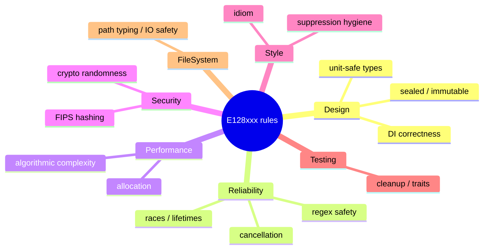

# Glossary — E128.Reference

> **One sentence:** Domain vocabulary and acronyms used across this wiki and the codebase.

*Updated: 2026-05-29T19:02:39Z*

---

## Terminology

| Term                | Definition                                                                                          | See also |
| ------------------- | --------------------------------------------------------------------------------------------------- | -------- |
| E128.Reference      | The reference repository this wiki documents.                                                       | [../index.md](../index.md) |
| E128.Analyzers      | The Roslyn analyzer + code-fix package shipped to nuget.org; the repo's flagship deliverable.       | [../architecture/integration-patterns.md](../architecture/integration-patterns.md) |
| Roslyn Analyzer     | A .NET compiler extension providing real-time diagnostics during build/edit.                         | — |
| Code Fix            | An automated remediation for a diagnostic, applied in the IDE or via `dotnet format`.                | — |
| Diagnostic ID       | A rule identifier (e.g., `E128064`); rules are numbered monotonically.                              | — |
| Deny by default     | Policy where every diagnostic defaults to `error`; relaxations are explicit.                         | [../guides/configuration.md](../guides/configuration.md) |
| Greeter / Greeting  | The trivial domain used by the reference Web/Cli apps to demonstrate DI and async patterns.          | [../architecture/data-flow.md](../architecture/data-flow.md) |
| Composition root    | The single place DI services are registered — `Program.cs` in the Web app.                          | — |
| Trusted Publishing  | OIDC-based NuGet publishing that exchanges a short-lived token for a publish credential, no stored keys. | [../architecture/deployment.md](../architecture/deployment.md) |
| PublicAPI tracking  | `PublicAPI.Shipped.txt`/`Unshipped.txt` files that gate analyzer API changes.                       | [../architecture/storage.md](../architecture/storage.md) |
| Release tracking    | `AnalyzerReleases.Shipped.md`/`Unshipped.md` files (RS2000–RS2008) tracking which rules shipped when. | — |
| SequentialRenameFixAllProvider | Shared fix-all provider for rename-based fixes; replaces `BatchFixer` for multi-rename cases. | [../architecture/integration-patterns.md](../architecture/integration-patterns.md) |
| Lode                | The repo's AI-owned markdown knowledge store under `lode/`; authoritative project memory.            | — |
| Deterministic script| A `scripts/*.sh` wrapper replacing ad-hoc commands; canonical path for all repeated operations.      | [cli-commands.md](cli-commands.md) |

## Acronyms

| Acronym | Expansion                          | Meaning                                                            |
| ------- | ---------------------------------- | ------------------------------------------------------------------ |
| CPM     | Central Package Management         | All package versions pinned in `Directory.Packages.props`.         |
| MTP     | Microsoft Testing Platform         | The .NET 10 test runner; replaces VSTest. Built into xUnit v3.     |
| TFM     | Target Framework Moniker           | e.g., `net10.0`, `netstandard2.0`.                                 |
| TDD     | Test-Driven Development            | Red-Green-Refactor.                                                |
| DI      | Dependency Injection               | `Microsoft.Extensions.DependencyInjection` here.                   |
| OIDC    | OpenID Connect                     | Token protocol behind trusted publishing.                          |
| TOCTOU  | Time-Of-Check To Time-Of-Use       | Race condition class flagged by E128056/E128064.                   |
| ReDoS   | Regular-expression Denial of Service | Backtracking attack guarded by E128011/E128013/E128014.          |
| FIPS    | Federal Information Processing Standards | Hash-algorithm compliance enforced by E128071.               |
| IVT     | InternalsVisibleTo                 | Exposes internals to test projects (used instead of reflection).   |
| CI      | Continuous Integration             | `ci.yml` format+build+test gate.                                   |
| ORM     | Object-Relational Mapper           | None used — reference uses an in-memory repository.                |

## Diagnostic Categories (E128xxx)

| Category    | Concern                                                       |
| ----------- | ------------------------------------------------------------- |
| Design      | Sealed/immutable/DI/unit-safe-types correctness               |
| Reliability | Races, lifetimes, cancellation, regex safety                  |
| Performance | Allocation and algorithmic-complexity reduction               |
| Security    | FIPS hashing, cryptographic randomness                        |
| Style       | Idiom and suppression hygiene                                 |
| Testing     | Test-project hygiene (cleanup, traits, reference assemblies)  |
| FileSystem  | Path-typing and file-I/O safety                               |
