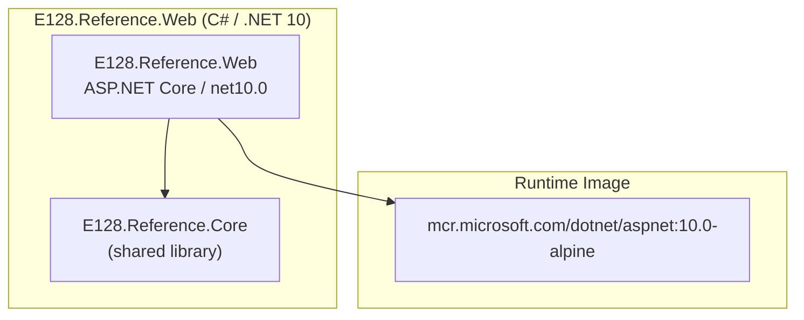

# dotnet-reference — Dependency Map

> Scope: `dotnet-reference` | Scan root: repo root
> Projects in solution: **9** | Production: **4** | Test: **5**
> Single-repo scan — all sub-projects share one `Directory.Build.props` and `Directory.Packages.props`.

## Project Summary

| Project                   | SDK              | Target          | Role                            | Direct Packages               |
| ------------------------- | ---------------- | --------------- | ------------------------------- | ----------------------------- |
| `E128.Reference.Core`     | `Microsoft.NET.Sdk`     | `net10.0`  | Shared library for Web + Cli    | —                             |
| `E128.Reference.Web`      | `Microsoft.NET.Sdk.Web` | `net10.0`  | ASP.NET Core web service        | — (project ref only)          |
| `E128.Reference.Cli`      | `Microsoft.NET.Sdk`     | `net10.0`  | Console executable              | `System.CommandLine`          |
| `E128.Analyzers`          | `Microsoft.NET.Sdk`     | `netstandard2.0` | Roslyn analyzer NuGet package | `Microsoft.CodeAnalysis.CSharp`, `Microsoft.CodeAnalysis.Workspaces.Common` |

All production projects also receive the following **analyzer packages** via `Directory.Build.props`
(`PrivateAssets="all"` — compile-time only, not shipped to consumers):

| Analyzer Package                                | Version          |
| ----------------------------------------------- | ---------------- |
| `AsyncFixer`                                    | 2.1.0            |
| `Meziantou.Analyzer`                            | 3.0.50           |
| `Microsoft.CodeAnalysis.CSharp.CodeStyle`       | 5.3.0            |
| `Microsoft.VisualStudio.Threading.Analyzers`    | 17.14.15         |
| `Roslynator.Analyzers`                          | 4.15.0           |
| `Roslynator.CodeAnalysis.Analyzers`             | 4.15.0           |
| `Roslynator.Formatting.Analyzers`               | 4.15.0           |
| `SharpSource`                                   | 1.33.1           |
| `SonarAnalyzer.CSharp`                          | 10.24.0.138807   |

## Cross-Project Dependency Heat Map

### External Service Dependencies

None. This repo has no client packages referencing external services.

### Infrastructure

None detected. No appsettings.json, connection strings, or infra config files present.

### Runtime Images

| Base image                              | Tag            | Type         |
| --------------------------------------- | -------------- | ------------ |
| `mcr.microsoft.com/dotnet/aspnet`       | `10.0-alpine`  | .NET runtime (production, E128.Reference.Web) |
| `mcr.microsoft.com/dotnet/sdk`          | `10.0-alpine`  | .NET SDK (restore + build stages)             |

> Tags are pinned to a minor version (`:10.0-alpine`), not a digest. They drift with
> patch releases but do not track `:latest`. No unpinned tags.

---

## Runtime & SDK Versions

| Artifact              | Value                                      | Source                                |
| --------------------- | ------------------------------------------ | ------------------------------------- |
| Runtime image         | `mcr.microsoft.com/dotnet/aspnet:10.0-alpine` | `Dockerfile` (final `runtime` stage) |
| SDK/build image       | `mcr.microsoft.com/dotnet/sdk:10.0-alpine`    | `Dockerfile` (`restore`/`build` stages) |
| .NET SDK pin          | `10.0.202`                                 | `global.json`                         |
| SDK rollForward       | `latestMajor` ⚠                           | `global.json` — permits any future major version |
| Target framework      | `net10.0` (all except `E128.Analyzers`)    | `Directory.Build.props`               |
| Analyzers TF          | `netstandard2.0`                           | `E128.Analyzers.csproj`               |
| CI SDK version        | `10.0.x`                                   | `.github/workflows/ci.yml` `setup-dotnet` |
| CI platform           | `ubuntu-24.04`                             | `.github/workflows/ci.yml`            |
| Test runner           | Microsoft.Testing.Platform                 | `global.json`                         |

> ⚠ `rollForward: "latestMajor"` in `global.json` allows the SDK to roll forward to
> any future major version. `latestPatch` or `patch` is the safer default.

---

## Per-Project Details

### E128.Reference.Core

**Role:** Shared domain library. No direct package dependencies — inherits analyzers
from `Directory.Build.props`. Referenced by Web and Cli via project reference.

### E128.Reference.Web

**Role:** ASP.NET Core web application (`Microsoft.NET.Sdk.Web`). No additional package
dependencies beyond the `E128.Reference.Core` project reference and shared analyzers.
Built and shipped via the multi-stage `Dockerfile`.

#### Service Layer Diagram

### E128.Reference.Cli

**Role:** Console executable using `System.CommandLine`. References `E128.Reference.Core`.

#### Key Packages

| Package             | Version | Role                     |
| ------------------- | ------- | ------------------------ |
| `System.CommandLine`| 2.0.6   | CLI argument parsing     |

### E128.Analyzers

**Role:** Roslyn analyzer NuGet package published to nuget.org as `E128.Analyzers`.
Targets `netstandard2.0` for maximum Roslyn host compatibility. Packaging is handled
by `publish.yml` via OIDC trusted publishing.

#### Key Packages

| Package                                | Version | Role                                     |
| -------------------------------------- | ------- | ---------------------------------------- |
| `Microsoft.CodeAnalysis.CSharp`        | 5.3.0   | Roslyn syntax/semantic analysis APIs     |
| `Microsoft.CodeAnalysis.Workspaces.Common` | 5.3.0 | Code fix / workspace APIs              |
| `PolySharp`                            | 1.15.0  | netstandard2.0 polyfill for nullable attributes (PrivateAssets=all) |

#### Publishing

- Packaged via `dotnet pack`, pushed via `dotnet nuget push`
- OIDC-based API key exchange (no stored secrets)
- Triggered by pushes to `src/E128.Analyzers/**` on `main`
- Version check gates the push (skips if version already on nuget.org)

---

## Test Stack (test projects — excluded from production tables)

| Package                                       | Version  | Role                              |
| --------------------------------------------- | -------- | --------------------------------- |
| `xunit.v3.mtp-v2`                             | 3.2.2    | xUnit v3 with MTP runner          |
| `TngTech.ArchUnitNET.xUnitV3`                 | 0.13.3   | Architecture invariant tests      |
| `Microsoft.CodeAnalysis.CSharp.Analyzer.Testing` | 1.1.3 | Roslyn analyzer test harness      |
| `Microsoft.CodeAnalysis.CSharp.CodeFix.Testing` | 1.1.3  | Roslyn code fix test harness      |
| `Microsoft.AspNetCore.Mvc.Testing`            | 10.0.6   | Integration test web host         |
| `Microsoft.Testing.Extensions.HangDump`       | 2.2.1    | Hang detection in CI              |
| `Microsoft.Testing.Extensions.TrxReport`      | 2.2.1    | TRX report output                 |

---

## Central Package Management

Versions are pinned in `Directory.Packages.props` (CPM). All projects use
`ManagePackageVersionsCentrally=true`. Transitive pins are enabled
(`CentralPackageTransitivePinningEnabled=true`). NuGet audit is active at `low`
severity for all deps (direct and transitive).

---

*Updated: 2026-04-21T13:23:50Z*
