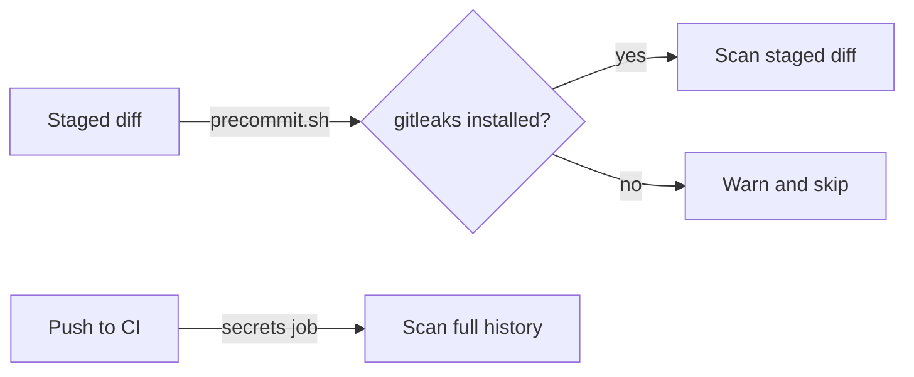

# Secret Scanning
*Updated: 2026-10-07T12:51:26Z*

The repository scans for secrets with gitleaks in two places: locally before each commit, and in CI over the full git history. Both use the default gitleaks ruleset plus the allowlist in `.gitleaks.toml`.

## Local Scan

`scripts/internal/precommit.sh` runs `gitleaks git --staged --no-banner --redact --exit-code 1` over the staged diff. The script counts a finding as a PII failure, the same as a home path or an email address. The `/yeet` skill calls it before it commits. `scripts/internal/commit.sh` also runs it unless you pass `--skip-precommit`.

- Output is redacted, so a secret never reaches the log.
- When `gitleaks` is not installed, the script prints a warning and skips the secret scan. The home path and email checks still run.
- `gitleaks` is an optional tool. See `.claude/rules/tooling.md` for the install command.

## CI Scan

The `secrets` job in `.github/workflows/ci.yml` runs in parallel with the `ci` job. It checks out the full history (`fetch-depth: 0`) and runs `gitleaks git --no-banner --redact --exit-code 1`.

The job installs gitleaks from the GitHub release tarball. The workflow pins the tool version and the SHA-256 checksum in the job `env` block (`GITLEAKS_VERSION`, `GITLEAKS_SHA256`). The install step fails when the checksum does not match. Change both values together when you upgrade.

## Allowlist

`.gitleaks.toml` extends the default ruleset (`useDefault = true`). It holds one allowlist entry for the analyzer option key constants, such as `ThresholdOptionKey`. These strings name an editorconfig key and are not credentials.

Add an allowlist entry only for a proven false positive. Match the narrowest line pattern you can.

## Invariants

- Never commit a real secret. Expose values through options classes bound to configuration (see `.claude/rules/security.md`).
- Never widen the allowlist to silence a real finding. Rotate the secret instead.
- Keep the local scan and the CI scan on the same flags, so a local pass predicts a CI pass.

## Related Files

- [claude-code-maintenance.md](claude-code-maintenance.md): script conventions and rule ownership
- [nuget-trusted-publishing.md](nuget-trusted-publishing.md): the other GitHub Actions workflow
